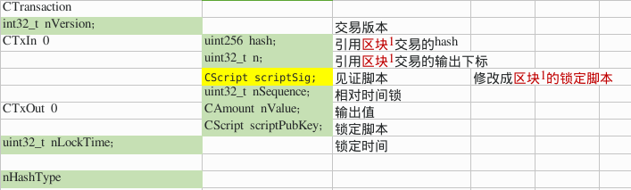
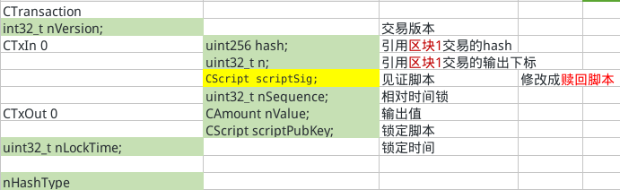
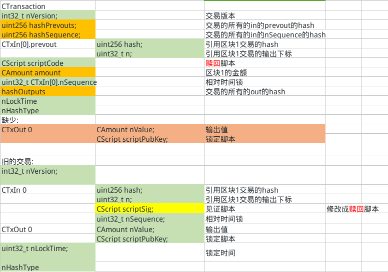

<!-- TOC -->

- [1. 说明](#1-说明)
- [2. P2SH交易的签名数据](#2-p2sh交易的签名数据)
- [3. P2WSH(隔离见证)交易的签名数据](#3-p2wsh隔离见证交易的签名数据)
- [4. 见证脚本的生成](#4-见证脚本的生成)
- [5. 总结](#5-总结)

<!-- /TOC -->

<a id="markdown-1-说明" name="1-说明"></a>
# 1. 说明

上一文 <数据签名>中我们介绍了P2PK,P2PKH,P2WPKH交易对什么数据进行签名以及见证脚本的生成的问题.这一文我们继续研究在P2SH,P2WSH交易中这两个问题的答案. 只有对这个问题理解了,才可以进行下一步编写更复杂的脚本.

我们思考几个问题:

* P2SH交易与P2PKH有显著的不同,其引入了赎回脚本,那么在生成交易hash时,在见证脚本中放赎回脚本还是锁定脚本?
* 怎么把签名数据与赎回脚本放入到见证脚本内的?

参考P2PKH的签名数据的生成:




<a id="markdown-2-p2sh交易的签名数据" name="2-p2sh交易的签名数据"></a>
# 2. P2SH交易的签名数据

我们动手做一笔P2SH-P2PK的实验,然后再来对着代码梳理问题

通过挖矿奖励得资金源:

```bash
# 获得coinbase的地址
COINBASEEC=`bx seed | bx ec-new`
COINBASEECADDRESS_INFO=`parse_privkey $COINBASEEC`

# 提取P2PKH地址
COINBASECP2PKHADDR=`echo $COINBASEECADDRESS_INFO | sed -n 13p | awk '{print $2}'`

bitcoin-cli generatetoaddress 101 $COINBASECP2PKHADDR

# 查询锁定脚本
bbasetx 1

# 提取私钥并导入到钱包
COINBASEPRIKEYWIF=`echo $COINBASEECADDRESS_INFO | sed -n 10p | awk '{print $2}'`
bitcoin-cli importprivkey $COINBASEPRIKEYWIF

# 查询余额
bitcoin-cli getbalance
```

生成p2sh脚本以及地址,将币转到p2sh地址
```bash
# 锁定脚本
<pubKey> OP_CHECKSIG

# 获得新的地址
NEWEC=`bx seed | bx ec-new`
NEWADDRESS_INFO=`parse_privkey $NEWEC`

# 提取公钥
NEWPUBKEY=`echo $NEWADDRESS_INFO | sed -n 11p | awk '{print $2}'`

# 提取私钥做备用
NEWPRVKEYWIF=`echo $NEWADDRESS_INFO | sed -n 10p | awk '{print $2}'`

REDEEM_SCRIPT=`bx script-encode "[$NEWPUBKEY] checksig"`

SCRIPT_ADDR=`echo $REDEEM_SCRIPT | bx sha256 | bx ripemd160 | bx base58check-encode --version 5`

# 1. 向脚本转账
UTXOID=`bitcoin-cli sendtoaddress $SCRIPT_ADDR 50.0 "" "" true`

# 2. 生成区块打包交易
bg 1

# 查看锁定交易
bhtx 102 1

UTXO_OUTPUT_SCRIPT=`bhtx 102 1 | python -c 'import json,sys;obj=json.load(sys.stdin);print(obj["vout"][0]["scriptPubKey"]["hex"])'`
```

对该比脚本输出进行`解锁交易`,引用到该笔交易的地址,并使用私钥进行签名
```bash
# 创建新的输出地址
NEWOUTADDR_EC=`bx seed | bx ec-new`
NEWOUTADDR_INFO=`parse_privkey $NEWOUTADDR_EC`
NEWOUTADDR_ADDRESS=`echo $NEWOUTADDR_INFO | sed -n 13p | awk '{print $2}'`

UTXO_VOUT=0

# 1. 创建交易
RAWTX=`bitcoin-cli createrawtransaction '''
[
    {
        "txid": "'$UTXOID'",
        "vout": '$UTXO_VOUT'
    }
]
''' '''
{
    "'$NEWOUTADDR_ADDRESS'": 49.9998
}
'''`

# 2. 签名交易
SIGNED_RAWTX_JSON=`bitcoin-cli signrawtransactionwithkey $RAWTX '''
[
    "'$NEWPRVKEYWIF'"
]''' '''
[
    {
        "txid": "'$UTXOID'",
        "vout": '$UTXO_VOUT',
        "scriptPubKey": "'$UTXO_OUTPUT_SCRIPT'",
        "redeemScript": "'$REDEEM_SCRIPT'"
    }
]
''' `
```

代码观察:

```bash
首先在Solver<-SignStep中,解析的是P2SH交易,提取出来P2SH脚本中赎回脚本的hash. 然后判断输入的赎回脚本hash是否与P2SH脚本中的hash相同.  

如果hash相同,再调用Solver<-SignStep解析赎回脚本, 签名数据时,把输入的scriptSig修改成赎回脚本.
```

签名的数据:  




<a id="markdown-3-p2wsh隔离见证交易的签名数据" name="3-p2wsh隔离见证交易的签名数据"></a>
# 3. P2WSH(隔离见证)交易的签名数据



<a id="markdown-4-见证脚本的生成" name="4-见证脚本的生成"></a>
# 4. 见证脚本的生成


```bash
# 相关源码
SignStep
ProduceSignature
```

这一文我们主要讲述P2SH,P2WSH的交易对于什么数据进行签名,我们再关注一下见证脚本生成的细节.

* P2SH: 见证脚本放入赎回脚本与对应赎回脚本的签名(如P2PK就放入签名,P2PKH放入公钥+签名)
* P2WSH: 见证脚本为空,隔离见证(交易后面的数据块)放入赎回脚本与对应赎回脚本的签名(如P2PK就放入签名,P2PKH放入公钥+签名)

<a id="markdown-5-总结" name="5-总结"></a>
# 5. 总结

通过对源码的阅读,我们对了上述的两个问题有了不同的解答:

* P2SH交易与P2PKH有显著的不同,其引入了赎回脚本,那么在生成交易hash时,在见证脚本中放赎回脚本还是锁定脚本?  => `赎回脚本`
* 怎么把签名数据与赎回脚本放入到见证脚本内的? `源码解析到P2SH时会push赎回脚本到栈内,再解析赎回脚本push签名`
