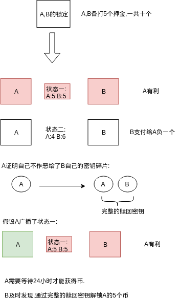
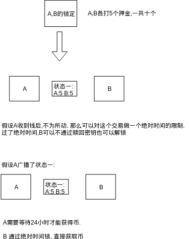

<!-- TOC -->

- [1. 说明](#1-说明)
- [2. nSequence](#2-nsequence)
- [3. CHECKSEQUENCEVERIFY 常用场景](#3-checksequenceverify-常用场景)
- [4. 参考资料](#4-参考资料)

<!-- /TOC -->

<a id="markdown-1-说明" name="1-说明"></a>
# 1. 说明

```c++
class CTxIn
COutPoint prevout;
CScript scriptSig;
uint32_t nSequence;
```

nSequence的功能与nLockTime一样,只不过将绝`对的高度,时间`转换成了`相对的高度,时间`.这里做一下nSequence以及CHECKSEQUENCEVERIFY相关的交易,并跟踪到相关代码来分析.


<a id="markdown-2-nsequence" name="2-nsequence"></a>
# 2. nSequence

(BIP68)


```c++
// 禁用nLockTime
static const uint32_t SEQUENCE_FINAL = 0xffffffff;

// 禁用nSequence
static const uint32_t SEQUENCE_LOCKTIME_DISABLE_FLAG = (1 << 31);

// 设置为512秒为粒度的时间单位
static const uint32_t SEQUENCE_LOCKTIME_TYPE_FLAG = (1 << 22);

// 有效值只取2个字节 (因为是相对的,所以不需要太大)
static const uint32_t SEQUENCE_LOCKTIME_MASK = 0x0000ffff;

// CalculateSequenceLocks 遍历所有in,从多个nSequence中提取一个nSequence值
// EvaluateSequenceLocks 和当前区块的时间/高度判断

// nSequence 高度 >= 当前区块高度. 高度还没到
// nSequence 时间 >= 当前区块时间(中位数). 时间还没到
if (lockPair.first >= block.nHeight || lockPair.second >= nBlockTime)
    return false;
```

通过挖矿奖励得资金源:

```bash
# 获得coinbase的地址
COINBASEEC=`bx seed | bx ec-new`
COINBASEECADDRESS_INFO=`parse_privkey $COINBASEEC`

# 提取P2PKH地址
COINBASECP2PKHADDR=`echo $COINBASEECADDRESS_INFO | sed -n 13p | awk '{print $2}'`

bitcoin-cli generatetoaddress 101 $COINBASECP2PKHADDR

# 查询锁定脚本
bbasetx 1

# 提取私钥并导入到钱包
COINBASEPRIKEYWIF=`echo $COINBASEECADDRESS_INFO | sed -n 10p | awk '{print $2}'`
bitcoin-cli importprivkey $COINBASEPRIKEYWIF

# 查询余额
bitcoin-cli getbalance
```

创建带有nSequence的`锁定交易`:

```bash
PRE_TXID=`_bbasehash 1`
PRE_VOUT=0

# 获得新的地址
NEWEC=`bx seed | bx ec-new`
NEWADDRESS_INFO=`parse_privkey $NEWEC`

# 提取P2PKH地址
NEWP2PkHADDR=`echo $NEWADDRESS_INFO | sed -n 13p | awk '{print $2}'`

# 1) 创建交易
RAWTX=`bitcoin-cli createrawtransaction '''
[
    {
        "txid": "'$PRE_TXID'",
        "vout": '$PRE_VOUT',
        "sequence": 300
    }
]
''' '''
{
    "'$NEWP2PkHADDR'": 49.9999
}
'''`

# 2) 签名交易
SIGNED_RAWTX_JSON=`bitcoin-cli signrawtransactionwithkey $RAWTX '''
[
    "'$COINBASEPRIKEYWIF'"
]
'''`

SIGNED_RAWTX=`echo $SIGNED_RAWTX_JSON | python -c 'import json,sys;obj=json.load(sys.stdin);print(obj["hex"])'`

# 3)发送交易 (无法被打包, 无法被放入到交易池中)
bitcoin-cli sendrawtransaction $SIGNED_RAWTX

bg 199

# 300个区块后,交易可被节点接受
bitcoin-cli sendrawtransaction $SIGNED_RAWTX

bg 1

# 查询交易
bhtx 301 1
```

<a id="markdown-3-checksequenceverify-常用场景" name="3-checksequenceverify-常用场景"></a>
# 3. CHECKSEQUENCEVERIFY 常用场景

(BIP112)

场景一: 超时托管(Escrow with Timeout ). Alice,Bob,Escrow 创建2-3多重签名. 在超时时间后Alice可以单独凭借签名取出来. (上链后再计算超时时间)

```bash
IF
    2 <Alice's pubkey> <Bob's pubkey> <Escrow's pubkey> 3 CHECKMULTISIG
ELSE
    "30d" CHECKSEQUENCEVERIFY DROP
    <Alice's pubkey> CHECKSIG
ENDIF
```

场景二: 可撤销承诺交易 (revocable commitment transactions). 



逻辑: A <- B. 1. A领取币需要24小时 2. A证明自己不会作恶,将半个赎回密钥给B. B可以通过赎回密钥惩罚

```bash
HASH160 <revokehash> EQUAL
IF
    <Bob's pubkey>
ELSE
    "24h" CHECKSEQUENCEVERIFY DROP
    <Alice's pubkey>
ENDIF
CHECKSIG
```

场景三: 哈系时间锁定合同 (Hash Time-Locked Contracts). 



为什么要有R-HASH 和 R? 在这个例子中没有用,因为有了<Alice's pubkey>了 ? 是这样吗?

逻辑: A <- B 1. A领取币需要24小时 2. 在绝对时间后,A广播了交易,B可以不通过赎回密钥领取币

```bash
HASH160 DUP <R-HASH> EQUAL
IF
    "24h" CHECKSEQUENCEVERIFY
    2DROP
    <Alice's pubkey>
ELSE
    <Commit-Revocation-Hash> EQUAL
    NOTIF
        "2015/10/20 10:33" CHECKLOCKTIMEVERIFY DROP
    ENDIF
    <Bob's pubkey>
ENDIF
CHECKSIG
```

逻辑: A -> B. 1. B 领取币要绝对+相对24小时 2. B证明自己不会作恶,将半个赎回密钥给A,A可以通过赎回密钥惩罚

```bash
HASH160 DUP <R-HASH> EQUAL
SWAP <Commit-Revocation-Hash> EQUAL ADD
IF
    <Alice's pubkey>
ELSE
    "2015/10/20 10:33" CHECKLOCKTIMEVERIFY
    "24h" CHECKSEQUENCEVERIFY
    2DROP
    <Bob's pubkey>
ENDIF
CHECKSIG
```


场景四: 双向挂钩侧链 (2-Way Pegged Sidechains)

猜想: 当币从第二层区块链回来的时候,通过新增加的符号REORGPROOFVERIFY证明,比特币在第二层被燃烧,然后在比特币层被解锁.具体要看源码分析.但看这个示例推理不出来细节.

```bash
IF
    lockTxHeight <lockTxHash> nlocktxOut [<workAmount>] reorgBounty Hash160(<...>) <genesisHash> REORGPROOFVERIFY
ELSE
    withdrawLockTime CHECKSEQUENCEVERIFY DROP HASH160 p2shWithdrawDest EQUAL
ENDIF
```

<a id="markdown-4-参考资料" name="4-参考资料"></a>
# 4. 参考资料

* https://en.bitcoin.it/wiki/Timelock (百科)
* https://github.com/bitcoin/bips/blob/master/bip-0068.mediawiki (BIP68)
* https://github.com/bitcoin/bips/blob/master/bip-0112.mediawiki (BIP112)
* https://github.com/bitcoinbook/bitcoinbook/blob/develop/ch12.asciidoc
