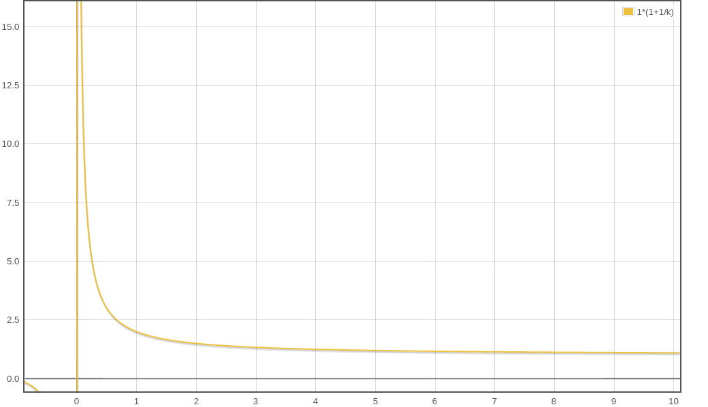

<!-- TOC -->

- [1. 说明](#1-说明)
- [2. 几个单位](#2-几个单位)
- [3. 当前区块的容量大小](#3-当前区块的容量大小)
    - [3.1. weight维度(虚拟大小)](#31-weight维度虚拟大小)
    - [3.2. 实际大小维度 (实际大小)](#32-实际大小维度-实际大小)
    - [3.3. python 脚本](#33-python-脚本)
- [4. 图](#4-图)
- [5. 最大容纳多少笔交易](#5-最大容纳多少笔交易)
- [6. 参考资料](#6-参考资料)

<!-- /TOC -->


<a id="markdown-1-说明" name="1-说明"></a>
# 1. 说明

2010年的时候Satoshi Nakamoto将区块链的大小显式修改成1MB. 在2017年之前没有被相信过,并且人们都相信需要一个硬分叉才可以修改区块的容量上限.

历史上对比特币的区块容量的改进方案与最终容量:
* BIP100: 矿工投票,建议值写在coinbase中,全网算力80%即可激活. (--硬分叉)
* BIP101(Bitcoin XT): 2016年开始立即提升限制为8MB,每两年翻一番,持续至2036,届时区块容量限制为(8.2G) (--硬分叉)
* BIP102: 一次性从1MB提升至2MB (--硬分叉)
* BIP103: 年增长率 (17.7%), 直到2063年7月,届时体积约为1.4GB (--硬分叉)
* BIP109: 全网75%算力可激活,体积限制提升至2MB (--硬分叉)
* 最终采取方案为隔离见证 `(--软分叉)`

软分叉的好处:  
软分叉的好处是前向兼容,前面版本的节点可以兼容后面版本的节点产生的区块.不会产生硬分叉导致分裂. 

硬分叉的坏处:  
大多数提议是硬分叉将区块扩大很多,但是大区块的坏处是容易形成中心化,因为磁盘是需要付出成本的. 比特币的优势是去中心化才体现出来的,一旦中心化, 1. 双花交易(等于是凭空创造出来币) 2. ddos拒绝指定账号服务(等于是中心化系统的封号) . 比特币会逐渐失去信任. 

<a id="markdown-2-几个单位" name="2-几个单位"></a>
# 2. 几个单位

当使用rpc接口查询的时候会有下面的信息:
```bash
# (没有隔离见证)交易:
  "size": 191,
  "vsize": 191,
  "weight": 764,

# (有隔离见证)交易:
  "size": 194,
  "vsize": 113,
  "weight": 449,

# vsize = (weight + 3) / 4. 表示1个vsize为4个weight
113 = (449 + 3) / 4

# 区块:
  "strippedsize": 217, 
  "size": 253,        
  "weight": 904,       

# weight = 1 * Witness + 4 * Non-witness
904 = 1* (253-217) + 4 * 217
```

* size: 实际的大小
* weight: 加了权重后的大小
* `vsize: (weight+3) / 4. 一个vsize等于4个weight`
* strippedsize: size减去了见证数据的大小

<a id="markdown-3-当前区块的容量大小" name="3-当前区块的容量大小"></a>
# 3. 当前区块的容量大小

隔离见证参考图:


```c++
// 代码
// ContextualCheckBlock
if (GetBlockWeight(block) > MAX_BLOCK_WEIGHT) {
    return state.DoS(100, false, REJECT_INVALID, "bad-blk-weight", false, strprintf("%s : weight limit failed", __func__));
}

// 经过我的修改,为了方便阅读理解
static inline int64_t GetBlockWeight(const CBlock& block)
{
    // 算大小时不算上见证的数据
    auto stripped_size = ::GetSerializeSize(block, SER_NETWORK, PROTOCOL_VERSION | SERIALIZE_TRANSACTION_NO_WITNESS);
    auto stripped_size3x = stripped_size * (WITNESS_SCALE_FACTOR - 1);
    // 算大小时算上见证的数据
    auto total_size = ::GetSerializeSize(block, SER_NETWORK, PROTOCOL_VERSION);
    return  stripped_size3x + total_size;
}
```

隔离见证之前区块的大小是简单的判断`block.size <= 1MB`. 但在隔离见证中,引入了weight的单位. 计算公式变成了:

```bash
# weight来源计算公式 (取自函数之上的注释):
weight = (stripped_size * 4) + witness_size 

# 简化计算公式:
因为: witness_size = total_size - stripped_size
所以: weight = (stripped_size * 3) + total_size

# 判断区块的大小的公式:
block.weight <= 4MB weight
```

<a id="markdown-31-weight维度虚拟大小" name="31-weight维度虚拟大小"></a>
## 3.1. weight维度(虚拟大小)

在隔离见证的情况下:  
设未启用权重,交易数量$n$, 交易$x$ byte, 见证$y$ byte  
设启用权重k,交易数量$m$,  交易$x$ byte, 见证$y$ byte   
权重在这里是一个打折的意思,虚拟上限(vsize)还是1MB,通过给见证数据打折实现交易数据比重的增多,从而增加交易数

$$\begin{aligned} 
n(x+y) = 1MB\\
n = \frac{1MB}{x+y}\\
m(k*x+y) = kMB\\
m = \frac{kMB}{k*x+y}\\
m = \frac{1MB}{x+\frac{y}{k}}\\
m > n
 \end{aligned}$$

且交易的数据永远小于1MB,使得过去的的版本也能接受:
$$\begin{aligned}
m(k*x+y) = kMB\\
m*k*x + m*y = kMB\\
m*x+\frac{m*y}{k} = 1MB\\
m*x=1MB-\frac{m*y}{k}\\
m*x < 1MB\\
 \end{aligned}$$

并且$vsize < size$ ,因为给见证数据$y$打上了折扣:

$$\begin{aligned}
vsize = \frac{k*x + y + k-1}{k}\\
vsize = x + \frac{y}{k} + 1 - \frac{1}{k}\\
size = (x+y)\\
vsize < size
 \end{aligned}$$
 

但是没有开启隔离见证时,$vsize = size$, 因为见证数据y为空,而交易x包含了见证数据.

$$\begin{aligned}
x = x + y  \\
y= 0\\
vsize=x+y+1-\frac{1}{k}\\
size=x+y\\
vsize = size\\
 \end{aligned}$$
 

<a id="markdown-32-实际大小维度-实际大小" name="32-实际大小维度-实际大小"></a>
## 3.2. 实际大小维度 (实际大小)

未隔离见证版本: 交易数量$n$, 交易$x$ byte, 见证$y$ byte,  交易大小: $x + y$ byte  
隔离见证版本: 交易数量$m$, 交易$x$ byte, 见证$y$ byte, 未隔离见证版本验证交易大小: $x$ byte, 实际大小: $x + y$ byte  
设区块大小一致,如下,使用隔离见证区块生成的交易体积小,交易总数也多,并且未隔离见证版本也能兼容区块体积:

$$\begin{aligned} 
n * (x+y) =  m * x\\
\frac{m}{n}=\frac{x+y}{x}\\
\because \frac{x+y}{x} > 1\\
\therefore \frac{m}{n} > 1\\
m > n\\
 \end{aligned}$$


假设实际区块扩容到了$z$byte,并且未隔离见证版本区块容量是$1$MB.得出实际区块大小由系数$k$决定,也就是交易$x$ byte与见证$y$ byte的比值, $k$越小,实际扩容空间越大.

$$\begin{aligned}
\because m * (x + y) = z\\
\therefore m = \frac{z}{x+y}\\
m =\frac{1MB(byte)}{x(byte/tx)}\\
\frac{1MB(byte)}{x(byte/tx)} = \frac{z}{x+y}\\
z = \frac{1MB(byte)}{{x(byte/tx)}}*(x+y)\\
x=ky\\
z = 1MB(byte) * \frac{(k+1)}{k}\\
z = 1MB(byte) * (1 + \frac{1}{k})\\
\end{aligned}$$



<a id="markdown-33-python-脚本" name="33-python-脚本"></a>
## 3.3. python 脚本

```py
def weight2vsize(weight):
    return (weight+3)/4

def size2weight(rawtxsize, witnesssize):
    return  rawtxsize * 3 + rawtxsize + witnesssize
```

<a id="markdown-4-图" name="4-图"></a>
# 4. 图

(1) 如果没有开启隔离见证:


(2) 如果开启了隔离见证. 


<a id="markdown-5-最大容纳多少笔交易" name="5-最大容纳多少笔交易"></a>
# 5. 最大容纳多少笔交易

* 全是非隔离见证交易大小: 1MB, 4587笔
* 全是隔离见证交易大小(交易108,见证数据110,weight542): 1.6MB, 7380笔

$$\begin{aligned}
1000000 / 108 = 9259\\
9259 * 542 = 5018378\\
5018378 > 4000000\\
4000000/542=7380\\
7380*218=1608840\\
\end{aligned}$$

<a id="markdown-6-参考资料" name="6-参考资料"></a>
# 6. 参考资料

* https://en.bitcoin.it/wiki/Block_size_limit_controversy (区块大小的历史)
* https://en.bitcoin.it/wiki/Segregated_Witness (隔离见证)
* https://en.bitcoin.it/wiki/Weight_units (单位: weight)  
* https://segwit.org/why-a-discount-factor-of-4-why-not-2-or-8-bbcebe91721e　（为什么因子是４）
