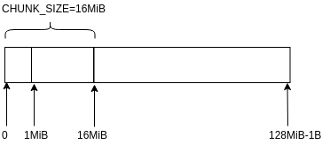

<!-- TOC -->

- [1. 说明](#1-说明)
- [2. 区块的存储](#2-区块的存储)
- [3. 基础概念](#3-基础概念)
- [4. python读取](#4-python读取)
- [5. 参考资料](#5-参考资料)

<!-- /TOC -->


<a id="markdown-1-说明" name="1-说明"></a>
# 1. 说明

比特币的特点:所有信息公开透明.通过写代码来浏览比特币的存储数据得知所有的区块信息,交易信息.可以做一些非常有趣的事情. 例如: 所有的转账记录 => 画成图 => 分析交易信息, 区块的版本信息 => 得知区块链版本的变迁

<a id="markdown-2-区块的存储" name="2-区块的存储"></a>
# 2. 区块的存储

重要的几个数据存储文件如下`(下文着重讲述高亮的2处文件)`:

* `blocks/blkxxxxx.dat (block data)`
* blocks/revxxxxx.dat (block undo data)
* `blocks/index/* block index (leveldb) `
* chainstate/* block chain state database (leveldb)

`打开文件处代码,可以通过这个回溯到相关读写处:`
```c++
// blocks/blkxxxxx.dat 
FILE* OpenBlockFile(const CDiskBlockPos &pos, bool fReadOnly) {
    return OpenDiskFile(pos, "blk", fReadOnly);
}

// blocks/index/*
CBlockTreeDB::CBlockTreeDB(size_t nCacheSize, bool fMemory, bool fWipe) : CDBWrapper(gArgs.IsArgSet("-blocksdir") ? GetDataDir() / "blocks" / "index" : GetBlocksDir() / "index", nCacheSize, fMemory, fWipe) {

leveldb::Status status = leveldb::DB::Open(options, path.string(), &pdb);
```

`核心存储区块的逻辑:`
```bash
SaveBlockToDisk

# 包括3步
# 1. GetSerializeSize 获取存储区块的大小
# 2. FindBlockPos 寻找到存储的位置,并分配好空间
# 3. WriteBlockToDisk 利用<序列化与反序列化>问中提到的技术,将区块写到磁盘上
```

文件的大小为128MiB,但是实际上不会存储满. 只会存储128MiB-1. (空间会分配满)




`核心存储leveldb索引的逻辑:`
```bash
FlushStateToDisk -> pblocktree->WriteBatchSync

# 存储如下key:value
# f + 文件号 : CBlockFileInfo 文件描述
# l : 上一个存储的文件序号
# b + 区块hash : CDiskBlockIndex
```

<a id="markdown-3-基础概念" name="3-基础概念"></a>
# 3. 基础概念

1) 字节序

* [u]int8_t
* [u]int16_t
* [u]int32_t
* [u]int64_t

以上类型都是以内存中的字节序序列化到磁盘上的,由于我们常用的是x86-64芯片,所以默认认为是`小端输出`

* uint256(base_blob<256>)

代码中以`uint8_t data[WIDTH];`,小端方式实现了大数字运算,所以默认是`小端输出`

2) compactSize

* 参考源码: https://github.com/bitcoin/bitcoin/blob/0.17/src/serialize.h#L253 
* 参考文档: https://bitcoin.org/en/developer-reference#compactsize-unsigned-integers
* 参考文档(注意这里应该是compactSize而不是varint): http://learnmeabitcoin.com/glossary/varint

在比特币中输出数组序列化对象时,会使用`compactSize`的技术,将数组的大小以不定长(1,3,5,9)的方式输出在数组前面.

3) varInt

* 参考源码: https://github.com/bitcoin/bitcoin/blob/0.17/src/serialize.h#L372
* 参考文档: https://bitcoin.stackexchange.com/questions/51620/cvarint-serialization-format 

部分结构体使用到了`varInt`可变长数字的技术,使整数存储空间变得更小.具体待展开.

<a id="markdown-4-python读取" name="4-python读取"></a>
# 4. python读取

辅助代码,从流中读取基础数据类型(小端)
```py
# ... 省略
def uint4(stream):
    return struct.unpack('I', stream.read(4))[0]

def hash32(stream):
    # return bytes
    return stream.read(32)[::-1]
# ... 省略
```

序列化到结构体:
```py
# ... 省略
class BlockHeader:
    def __init__(self, stream):
        self.nVersion = uint4(stream)
        self.hashPrevBlock = hash32(stream)
        self.hashMerkleRoot = hash32(stream)
        self.nTime = uint4(stream)
        self.nBits = uint4(stream)
        self.nNonce = uint4(stream)
# ... 省略
```

详细源码:  

* https://github.com/yqsy/yqsy.notes/blob/master/source/_posts/business/bitcoin/py/loadblock.py

因为索引是存储在leveldb中的,所以需要安装`pyvel支持库`
```bash
# leveldb 依赖库安装
sudo pip3 install plyvel
```

<a id="markdown-5-参考资料" name="5-参考资料"></a>
# 5. 参考资料

* https://en.bitcoin.it/wiki/Bitcoin_Core_0.11_(ch_2):_Data_Storage  (wiki中的说明)
* https://github.com/bitcoin/bitcoin/blob/0.17/doc/files.md (bitcoin源码文件说明)
* https://github.com/tenthirtyone/blocktools  (python源码)
* https://www.ccn.com/block-parser-how-read-bitcoin-block-chain/ (python源码文章介绍)
* https://github.com/alecalve/python-bitcoin-blockchain-parser (解析leveldb索引的源码)

数据结构:

* https://en.bitcoin.it/wiki/Block (区块)
* https://en.bitcoin.it/wiki/Block_hashing_algorithm (区块头)
* https://en.bitcoin.it/wiki/Transaction (交易,in,out)
