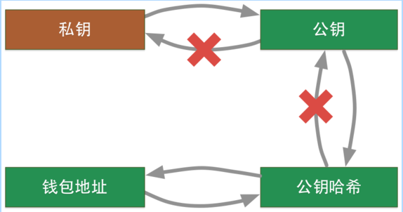
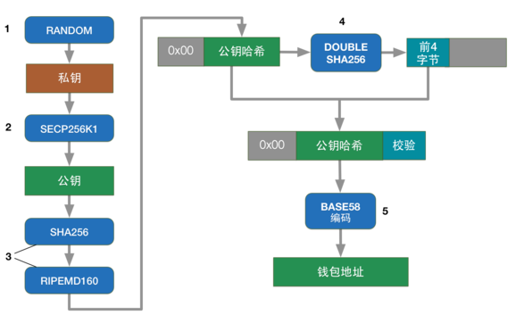

<!-- TOC -->

- [1. 说明](#1-说明)
- [2. libbitcoin梳理P2PKH地址的关系](#2-libbitcoin梳理p2pkh地址的关系)
- [3. libbitcoin梳理P2SH地址的关系](#3-libbitcoin梳理p2sh地址的关系)
- [4. BIP38 私钥加密](#4-bip38-私钥加密)
- [5. BIP39 助记词](#5-bip39-助记词)
- [6. BIP32 & BIP44 分层确定钱包](#6-bip32--bip44-分层确定钱包)
- [7. 将命令行放到zshrc](#7-将命令行放到zshrc)
- [8. bitcoin-cli获取地址](#8-bitcoin-cli获取地址)
- [9. 参考资料](#9-参考资料)

<!-- /TOC -->

<a id="markdown-1-说明" name="1-说明"></a>
# 1. 说明

比特币的转账是基于密码学的,借助于`unspent transaction output (UTXO)`(未花费输出),`Secp256k1 with ECDSA`(椭圆曲线数字签名)等技术,完成了货币的支付职能.类比于传统中心化系统的`帐号,密码,账户+密码验证->转账`,在比特币中变成了`公钥,私钥,私钥签名+公钥认证->转账`.本文简单讲述一下,私钥,公钥,公钥哈系,钱包地址之间的关系,并提供shell指令以供方便使用.

关系:  


流程图:  


(图片来源: 互联网)


(图片来源: https://en.bitcoin.it/wiki/Address)

<a id="markdown-2-libbitcoin梳理p2pkh地址的关系" name="2-libbitcoin梳理p2pkh地址的关系"></a>
# 2. libbitcoin梳理P2PKH地址的关系
安装libbitcoin-explorer:
```bash
wget https://github.com/libbitcoin/libbitcoin-explorer/releases/download/v3.2.0/bx-linux-x64-qrcode
sudo mv bx-linux-x64-qrcode /usr/local/bin/bx
chmod +x /usr/local/bin/bx
```

从源码中剥离得到生成segwit地址的python脚本:
```bash
sudo wget https://raw.githubusercontent.com/yqsy/yqsy.notes/master/source/_posts/business/bitcoin/script/getsegwitaddr -O /usr/local/bin/getsegwitaddr
sudo chmod +x /usr/local/bin/getsegwitaddr
```

提供以下shell脚本方便日常使用:  

* parse_privkey 解析私钥
* parse_privkeywif 解析私钥wif
* parse_pubkey_uncompressed 解析未压缩公钥
* parse_pubkey_compressed 解析压缩公钥
* parse_pubkeyhash 公钥哈系 -> 钱包地址
* parse_address  钱包地址 -> 公钥哈系

```bash
# 私钥 -> 公钥 -> 公钥哈系 -> 钱包地址:
parse_privkey() {
    PRIKEY=$1
    PRIKEY_WIF_UNCOMPRESSED=`bx ec-to-wif -u $PRIKEY`
    PUBKEY_UNCOMPRESSED=`bx wif-to-public $PRIKEY_WIF_UNCOMPRESSED`
    PUBKEYHASH_UNCOMPRESSED=`bx sha256 $PUBKEY_UNCOMPRESSED | bx ripemd160`
    P2PKHADDRESS_UNCOMPRESSED=`bx address-encode -v 0 $PUBKEYHASH_UNCOMPRESSED`
    URI_UNCOMPRESSED=`bx uri-encode $P2PKHADDRESS_UNCOMPRESSED`
    QRCODE_UNCOMPRESSED=`bx qrcode -p $P2PKHADDRESS_UNCOMPRESSED`

    echo "[未压缩]" &&
    echo 私钥: $PRIKEY &&
    echo 私钥WIF: $PRIKEY_WIF_UNCOMPRESSED &&
    echo 公钥: $PUBKEY_UNCOMPRESSED &&
    echo 公钥hash: $PUBKEYHASH_UNCOMPRESSED &&
    echo P2PKH地址: $P2PKHADDRESS_UNCOMPRESSED &&
    echo URI: $URI_UNCOMPRESSED 

    echo $QRCODE_UNCOMPRESSED > /tmp/uncompressed.png

    PRIKEY_WIF_COMPRESSED=`bx ec-to-wif $PRIKEY`
    PUBKEY_COMPRESSED=`bx wif-to-public $PRIKEY_WIF_COMPRESSED`
    PUBKEYHASH_COMPRESSED=`bx sha256 $PUBKEY_COMPRESSED | bx ripemd160`
    P2PKHADDRESS_COMPRESSED=`bx address-encode -v 0 $PUBKEYHASH_COMPRESSED`
    URI_COMPRESSED=`bx uri-encode $P2PKHADDRESS_COMPRESSED`
    QRCODE_COMPRESSED=`bx qrcode -p $P2PKHADDRESS_COMPRESSED`

    P2SH_P2WPKH=`echo "0 [$PUBKEYHASH_COMPRESSED]" | bx script-encode | bx sha256 | bx ripemd160 | bx base58check-encode --version 5`
    P2WPKH=`getsegwitaddr $PUBKEYHASH_COMPRESSED`

    echo "[压缩]" &&
    echo 私钥: $PRIKEY &&
    echo 私钥WIF: $PRIKEY_WIF_COMPRESSED &&
    echo 公钥: $PUBKEY_COMPRESSED &&
    echo 公钥hash: $PUBKEYHASH_COMPRESSED &&
    echo P2PKH地址: $P2PKHADDRESS_COMPRESSED &&
    echo URI: $URI_COMPRESSED &&
    echo P2SH-P2WPKH: $P2SH_P2WPKH
    echo P2WPKH: $P2WPKH

    echo $QRCODE_COMPRESSED > /tmp/compressed.png
} 

# 私钥wif -> 私钥 -> 公钥 -> 公钥哈系 -> 钱包地址:
parse_privkeywif() {
    PRIKEYWIF=$1
    parse_privkey `bx wif-to-ec $PRIKEYWIF`
}

# 公钥[未压缩] -> 公钥哈系 -> 钱包地址
parse_pubkey_uncompressed() {
    PUBKEY_UNCOMPRESSED=$1
    PUBKEYHASH_UNCOMPRESSED=`bx sha256 $PUBKEY_UNCOMPRESSED | bx ripemd160`
    P2PKHADDRESS_UNCOMPRESSED=`bx address-encode -v 0 $PUBKEYHASH_UNCOMPRESSED`
    URI_UNCOMPRESSED=`bx uri-encode $P2PKHADDRESS_UNCOMPRESSED`
    echo "[未压缩]" &&
    echo 公钥: $PUBKEY_UNCOMPRESSED &&
    echo 公钥hash: $PUBKEYHASH_UNCOMPRESSED &&
    echo P2PKH地址: $P2PKHADDRESS_UNCOMPRESSED &&
    echo URI: $URI_UNCOMPRESSED 
}

# 公钥[压缩] -> 公钥哈系 -> 钱包地址
parse_pubkey_compressed() {
    PUBKEY_COMPRESSED=$1
    PUBKEYHASH_COMPRESSED=`bx sha256 $PUBKEY_COMPRESSED | bx ripemd160`
    P2PKHADDRESS_COMPRESSED=`bx address-encode -v 0 $PUBKEYHASH_COMPRESSED`
    URI_COMPRESSED=`bx uri-encode $P2PKHADDRESS_COMPRESSED`
    P2SH_P2WPKH=`echo "0 [$PUBKEYHASH_COMPRESSED]" | bx script-encode | bx sha256 | bx ripemd160 | bx base58check-encode --version 5`
    P2WPKH=`getsegwitaddr $PUBKEYHASH_COMPRESSED`
    echo "[压缩]" &&
    echo 公钥: $PUBKEY_COMPRESSED &&
    echo 公钥hash: $PUBKEYHASH_COMPRESSED &&
    echo P2PKH地址: $P2PKHADDRESS_COMPRESSED &&
    echo URI: $URI_COMPRESSED  &&
    echo P2SH-P2WPKH: $P2SH_P2WPKH
    echo P2WPKH: $P2WPKH
}

# 公钥哈系 -> 钱包地址
parse_pubkeyhash() {
    PUBKEYHASH=$1
    P2PKHADDRESS=`bx address-encode -v 0 $PUBKEYHASH`
    URI=`bx uri-encode $P2PKHADDRESS`
    P2SH_P2WPKH=`echo "0 [$PUBKEYHASH]" | bx script-encode | bx sha256 | bx ripemd160 | bx base58check-encode --version 5`
    P2WPKH=`getsegwitaddr $PUBKEYHASH`
    echo 公钥hash: $PUBKEYHASH &&
    echo P2PKH地址: $P2PKHADDRESS &&
    echo URI: $URI &&
    echo P2SH-P2WPKH: $P2SH_P2WPKH
    echo P2WPKH: $P2WPKH
}

# 钱包地址 -> 公钥哈系
parse_address() {
    P2PKHADDRESS=$1
    PUBKEYHASH=`bx address-decode  $P2PKHADDRESS | sed -n 4p | awk '{print $2}' `
    URI=`bx uri-encode $P2PKHADDRESS`
    P2SH_P2WPKH=`echo "0 [$PUBKEYHASH]" | bx script-encode | bx sha256 | bx ripemd160 | bx base58check-encode --version 5`
    P2WPKH=`getsegwitaddr $PUBKEYHASH`
    echo 公钥hash: $PUBKEYHASH &&
    echo P2PKH地址: $P2PKHADDRESS &&
    echo URI: $URI &&
    echo P2SH-P2WPKH: $P2SH_P2WPKH
    echo P2WPKH: $P2WPKH
}

# 创建新私钥
parse_privkey `bx seed | bx ec-new`
```

<a id="markdown-3-libbitcoin梳理p2sh地址的关系" name="3-libbitcoin梳理p2sh地址的关系"></a>
# 3. libbitcoin梳理P2SH地址的关系

```bash
echo "dup hash160 [e0a9980de27a65fc49069fce46fefbff9d6990ce] equalverify checksig" |  bx script-encode  | bx sha256 | bx ripemd160 | bx base58check-encode --version 5
```

<a id="markdown-4-bip38-私钥加密" name="4-bip38-私钥加密"></a>
# 4. BIP38 私钥加密

上文直接下载的bx二进制在这里失去了作用,所以我们要从源码编译bx,加上开启`icu`的选项
```bash
wget https://raw.githubusercontent.com/libbitcoin/libbitcoin-explorer/version3/install.sh

mkdir /home/yq/libbitcoin-build
chmod +x install.sh
./install.sh --with-icu --with-png --with-qrencode --build-icu --build-zlib --build-png --build-qrencode --build-boost --build-zmq --prefix=/home/yq/libbitcoin-build

# 把之前的删除
sudo rm -rf /usr/local/bin/bx

# 环境变量添加
cat >> ~/.profile << EOF
# bx
export PATH=/home/yq/libbitcoin-build/bin:\$PATH
EOF
```

提供以下shell脚本方便日常使用:  

* encryptkey 加密私钥
* decryptkey 解密私钥

```bash
# 私钥,对称密钥 -> 加密私钥
encryptkey() {
    PRIKEY=$1
    PASSPHRASE=$2
    bx ec-to-ek $PASSPHRASE $PRIKEY
}

# 加密私钥,对称密钥 -> 私钥
decryptkey() {
    ENCRYPTED_PRIKEY=$1
    PASSPHRASE=$2
    bx ek-to-ec $PASSPHRASE $ENCRYPTED_PRIKEY
}

# 实验 (加密后的私钥前缀为6p)
encryptkey 1801f9286f5a71eb77534f26804b37a24abe54ea3dc0933a3568e89076dd9d4d abc123456

decryptkey 6PYWxXWVyd4xBdcgSEpcXL378fg49FnvSmgbQZwr8EEKKKng62qwVBzawd abc123456
```

<a id="markdown-5-bip39-助记词" name="5-bip39-助记词"></a>
# 5. BIP39 助记词

BIP39的目的是`使得熵变得方便记忆`,具体过程如下:

首先生成128~256位随机bit,映射成单词:

1. 生成 128,160,192,224,256 (bit)的随机数字
2. 加上4,5,6,7,8长度的checksum
3. 每11bit(0~2047)映射一个单词,映射成长度为12,15,18,21,24的单词组.

然后使用密钥延伸函数PBKDF2,将助记词表示的长度为128至256位的熵导出长度为`512位的种子`

1. 将助记词作为PBKDF2密钥延伸函数的参数一
2. 将字符串"mnemonic"与`可选`的用户提供的`密码串`表示"盐"作为PBKDF2密钥延伸函数的参数二
3. PBKDF2密钥延伸函数使用HMAC-SHA512,使用`2048次`哈系,产生一个`512位的值`作为最终输出


```bash
# 生成助记词
bx seed -b 128 | bx mnemonic-new

# 助记词转换为熵
seed=`bx mnemonic-to-seed --language en hunt donkey measure alert circle someone opinion south diagram video figure atom`
echo $seed
```

<a id="markdown-6-bip32--bip44-分层确定钱包" name="6-bip32--bip44-分层确定钱包"></a>
# 6. BIP32 & BIP44 分层确定钱包

Hierarchical Deterministic (HD) Wallets (分层决定性钱包)

HD 钱包的目的是`使用一个seed可以扩展生成无限个私钥/公钥`,具体过程如下:

* 使用HMAC-SHA512 hash `root seed` 生成 1. 256bit的 `私钥` (可生成`公钥`) 2. 256bit的`链码` 
* 两种扩展密钥方式: 1.`私钥+链码+序号`扩展下一层私钥 2.`公钥+链码+序号`扩展下一层公钥. xprv包含私钥+链码,xpub包含公钥+链码
* 搭配上硬化/非硬化的逻辑:
  * `xprv 私钥+链码+序号`扩展下一层`私钥`(`硬化`使用`私钥`扩展,`非硬化`使用私钥生成的`公钥`扩展)
  * `xpub 公钥+链码+序号`扩展下一层`公钥`(只能`非硬化`使用`公钥`扩展)

非硬化地址的安全问题: 母xpub (包含公钥+链码)  + 子私钥可以`推断出母私钥`,通过母私钥可以推断出所有的`子密钥`

BIP44: (m / purpose' / coin_type' / account' / change / address_index)

```bash
# hd私钥前缀为xprv
hd_prv=`bx hd-new $seed`

# hd公钥前缀为xpub
hd_pub=`bx hd-to-public $hd_prv`

# m/44'/60'/0'/0 的扩展密钥

change_prv=`echo $hd_prv | bx hd-private -d -i 44 | bx hd-private -d -i 60 | bx hd-private -d -i 0 | bx hd-private -i 0`
change_pub=`bx hd-to-public $change_prv`

# m/44'/60'/0'/0/0
parse_privkey  `echo $change_prv | bx hd-private -i 0 | bx hd-to-ec`

# m/44'/60'/0'/0/9
parse_privkey  `echo $change_prv | bx hd-private -i 9 | bx hd-to-ec`
```

<a id="markdown-7-将命令行放到zshrc" name="7-将命令行放到zshrc"></a>
# 7. 将命令行放到zshrc

```bash
wget -O ~/.bitcoinaddress.rc https://raw.githubusercontent.com/yqsy/yqsy.notes/master/source/_posts/business/bitcoin/script/bitcoinaddress.rc

cat >> ~/.zshrc << EOF
source ~/.bitcoinaddress.rc
EOF
```

<a id="markdown-8-bitcoin-cli获取地址" name="8-bitcoin-cli获取地址"></a>
# 8. bitcoin-cli获取地址

源码:  
```c++
// P2PKH 地址
base58Prefixes[PUBKEY_ADDRESS] = std::vector<unsigned char>(1,0);
// P2SH 地址
base58Prefixes[SCRIPT_ADDRESS] = std::vector<unsigned char>(1,5);
// 私钥WIF 地址
base58Prefixes[SECRET_KEY] =     std::vector<unsigned char>(1,128);
// BIP32 pubkey
base58Prefixes[EXT_PUBLIC_KEY] = {0x04, 0x88, 0xB2, 0x1E};
// BIP32 private key
base58Prefixes[EXT_SECRET_KEY] = {0x04, 0x88, 0xAD, 0xE4};
// 隔离见证地址前缀
bech32_hrp = "bc";

// P2PKH P2SH encode 源码位置
DestinationEncoder
```

同样这也是常用的地址,实践:  
```bash
# P2PKH地址 (1JHzZxUHgGL2L2otywxWAMTXfcqGzogupE)
bitcoin-cli getnewaddress "" legacy

# P2WPKH地址 (bc1q62zwwkge4xxgcvmmg709r6qdkf4znzjpj54cn0)
bitcoin-cli getnewaddress "" bech32

# P2SH-P2WPKH地址 (35zgCXB4GNrAzAGGzxcKKbcRx9KPcuBTvh) 
bitcoin-cli getnewaddress "" p2sh-segwit
```

<a id="markdown-9-参考资料" name="9-参考资料"></a>
# 9. 参考资料

上文命令行参考:  

* https://github.com/libbitcoin/libbitcoin-explorer (libbitcoin-explorer)
* https://github.com/libbitcoin/libbitcoin-explorer/wiki/Wallet-Commands (libbitcoin-explorer command)

地址生成工具:  

* https://www.bitaddress.org/ (bitaddress)
* https://www.mobilefish.com/services/cryptocurrency/cryptocurrency.html (地址生成 & 原理解释)

地址生成源码:

* https://github.com/bitcoin/bitcoin/blob/master/test/functional/test_framework/address.py 

地址原理解释:  

* https://en.bitcoin.it/wiki/Wallet_import_format (私钥->wif, wif->私钥)
* https://en.bitcoin.it/wiki/Technical_background_of_version_1_Bitcoin_addresses (生成比特币地址)

便捷查询:  

* https://en.bitcoin.it/wiki/List_of_address_prefixes (prefix)


BIP39:

* https://iancoleman.io/bip39/ (bip39生成)
* https://www.mobilefish.com/download/ethereum/bip39.html (bip39生成 & 原理解释)
* https://github.com/bitcoin/bips/blob/master/bip-0039/english.txt (bip39英语单词映射)
* https://www.youtube.com/watch?v=hRXcY_tIlrw&t=1s (youtube原理解释)

BIP32 & BIP44:

* https://www.mobilefish.com/download/ethereum/hd_wallet.html (bip32,44生成 & 原理解释)
* https://www.youtube.com/watch?v=2HrMlVr1QX8 (youtube原理解释)

BIP173(隔离见证地址):

* https://github.com/bitcoin/bips/blob/master/bip-0173.mediawiki
* http://bitcoin.sipa.be/bech32/demo/demo.html (隔离见证地址转 pubkey hash & script hash)

书籍参考:  

* https://bitcoinbook.info/wp-content/translations/cmn/book.pdf (精通比特币第四章/第五章)
