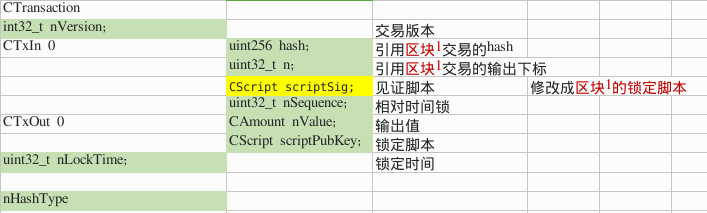

<!-- TOC -->

- [1. 说明](#1-说明)
- [2. P2PKH交易的签名数据](#2-p2pkh交易的签名数据)
- [3. 复杂P2PKH交易的签名数据](#3-复杂p2pkh交易的签名数据)
- [4. P2WPKH(隔离见证)交易的签名数据](#4-p2wpkh隔离见证交易的签名数据)
- [5. 签名 & 公钥在脚本中的运用](#5-签名--公钥在脚本中的运用)
- [6. 见证脚本的生成](#6-见证脚本的生成)
- [7. hash类型](#7-hash类型)
- [8. 总结](#8-总结)
- [9. 参考资料](#9-参考资料)

<!-- /TOC -->


<a id="markdown-1-说明" name="1-说明"></a>
# 1. 说明

前面我们说道:

> 比特币的转账是基于密码学的,借助于`unspent transaction output (UTXO)`(未花费输出),`Secp256k1 with ECDSA`(椭圆曲线数字签名)等技术,完成了货币的支付职能.

这一文我们思考几个问题: 

* (1) 转账是对什么数据进行签名作为验证? 
* (2) 中间人攻击,用另一对私钥,公钥,来生成交易和签名,怎么检测到? https有CA认证,比特币怎么做?
* (3) 中间人攻击,签名数据不变,将转账地址修改到别的地址? 怎么检测到?
 
我们回顾一下非对称签名算法在https协议中的应用的流程,服务器为了证明自己的身份,用私钥加密证书hash作为证书签名,连同公钥一起发送给用户.用户的浏览器使用公钥解密加密数据,得到证书hash,判断与计算证书hash得到的值是否相等,相等则可以证明对方的身份.流程如下:  

* 服务端: 证书hash -> 私钥加密 -> 签名. 签名 & 公钥 发送给用户
* 客户端: 签名 -> 公钥解密 -> 证书hash. 本地计算证书hash == 证书hash & 并且在CA验证证书的有效性.

我们根据这个信息,简单推测一下比特币交易的签名 & 认证 流程:

* 交易发起人: 交易hash -> 私钥加密 -> 签名. 签名 & 公钥 发送给用户
* 交易验证者: 签名 -> 公钥解密 -> 交易hash. 本地计算交易hash == 交易hash & 公钥和之前输出的公钥hash相匹配

我们通过代码来研究这几个问题.

<a id="markdown-2-p2pkh交易的签名数据" name="2-p2pkh交易的签名数据"></a>
# 2. P2PKH交易的签名数据

以下为做交易时断点下来:

```bash
# 签名
SignatureHash <- MutableTransactionSignatureCreator::CreateSig <- CreateSig <- SignStep(3 usages) <- ProduceSignature <- signrawtransactionwithkey

# 验证
SignatureHash<CMutableTransaction> - GenericTransactionSignatureChecker<CMutableTransaction>::CheckSig <- EvalScript <- VerifyScript!!! <- ProduceSignature <- SignTransaction <- signrawtransactionwithkey

# 序列化数据选择
CTransactionSignatureSerializer
```

我们尝试做一笔引用1笔输出的交易,`花费区块1的奖励,在102块区块中输出到新的地址`:

https://github.com/yqsy/yqsy.notes/tree/master/source/_posts/business/bitcoin/debug/spendheight1


提取相关hash的代码: 
```c++
// CTransactionSignatureSerializer 的序列化函数只生成CTransaction的序列化
CTransactionSignatureSerializer<T> txTmp(txTo, scriptCode, nIn, nHashType);
CHashWriter ss(SER_GETHASH, 0);
ss << txTmp << nHashType;
return ss.GetHash();
```



通过上图我们发现,签名的的数据即是交易数据,代码中的结构体为`CTransaction`.`唯一`做的修改是将见证脚本中的数据(没有签名时为空)修改成`区块1的锁定脚本`. 

签名交易为什么要关注前向的锁定脚本呢? (我并没有思考出来一个合理的解释) 因为即使没有前向的锁定脚本,也能通过hash & n 定位到前向的输出交易. 而且一旦作恶修改前向锁定脚本,相应的交易hash也会修改.

<a id="markdown-3-复杂p2pkh交易的签名数据" name="3-复杂p2pkh交易的签名数据"></a>
# 3. 复杂P2PKH交易的签名数据

我们尝试做一笔引用2笔输出的交易,`花费区块1 & 2的奖励,在103块区块中输出到新的地址,并且有找零`:

https://github.com/yqsy/yqsy.notes/tree/master/source/_posts/business/bitcoin/debug/spendheight2


通过上图我们发现,当有多比vin的前提下,针对一笔in的签名会对其他的in置为空.这是为了去除变化的干扰数据(其他签名).


<a id="markdown-4-p2wpkh隔离见证交易的签名数据" name="4-p2wpkh隔离见证交易的签名数据"></a>
# 4. P2WPKH(隔离见证)交易的签名数据

我们尝试做一笔引用一笔隔离见证输出的交易,花费区块1的见面管理,在101区块中输出到新的地址:

https://github.com/yqsy/yqsy.notes/tree/master/source/_posts/business/bitcoin/debug/spendsegwitheight1


与旧的交易的签名数据的差异:

1. 将时间复杂度从O(n^2)转换为O(n).因为旧的交易,对于每一比in都要做处理没有cache
2. 引用交易的输出金额

参考: https://github.com/bitcoin/bips/blob/master/bip-0143.mediawiki

<a id="markdown-5-签名--公钥在脚本中的运用" name="5-签名--公钥在脚本中的运用"></a>
# 5. 签名 & 公钥在脚本中的运用

P2PKH加锁与解锁的堆栈:
```bash
# scriptPubKey (prev out)
OP_CHECKSIG
OP_EQUALVERIFY
<pubkeyHash>
OP_HASH160
OP_DUP

# scriptSig (in)
<pubKey>
<sig>
```

相关验证的源码:
```c++
EvalScript

case OP_CHECKSIG:
case OP_CHECKSIGVERIFY:
```

通过当比交易以及引用输出的锁定脚本恢复得到被签名的数据,然后对其hash. 与见证脚本中的公钥解锁签名得到的hash值进行对比,相等就说明交易签名者拥有私钥,是交易的发起人.

<a id="markdown-6-见证脚本的生成" name="6-见证脚本的生成"></a>
# 6. 见证脚本的生成

```bash
# 相关源码
SignStep
ProduceSignature
```

这一文我们主要讲述P2Pk,P2PKH,P2WPKH的交易对于什么数据进行签名,我们再关注一下见证脚本生成的细节.

* P2Pk: 见证脚本只要放入签名即可
* P2PKH: 见证脚本需要放入签名和公钥
* P2WPKH: 见证脚本为空,隔离见证(交易后面的数据块)放入签名和公钥

<a id="markdown-7-hash类型" name="7-hash类型"></a>
# 7. hash类型

当我们使用`signrawtransactionwithkey` rpc接口时,有一个参数会让用户输入签名的方式,我们来分析一下各个参数都是派什么用场的:

```bash
    {"ALL", SIGHASH_ALL},
    {"NONE", SIGHASH_NONE},
    {"SINGLE", SIGHASH_SINGLE},
    {"ALL|ANYONECANPAY", SIGHASH_ALL|SIGHASH_ANYONECANPAY},
    {"NONE|ANYONECANPAY", SIGHASH_NONE|SIGHASH_ANYONECANPAY},
    {"SINGLE|ANYONECANPAY", SIGHASH_SINGLE|SIGHASH_ANYONECANPAY},
```

SIGHASH_ALL:

对所有交易的输入,输出进行签名

SIGHASH_NONE:  

如下图所示,不关心比特币的去向,不把输出的地址作为签名数据,其他人可以任意修改输出地址,输出金额 (为什么要做这种功能?不是很理解)


SIGHASH_SINGLE:
 
如下图所示,不关心其他比特币的去向. (让其他比特币的去向由其他拥有者来填写)


SIGHASH_ANYONECANPAY:

如下图所示, 不关心其他比特币的来源. (让其他比特币的来源由其他拥有者来填写)


<a id="markdown-8-总结" name="8-总结"></a>
# 8. 总结

通过对源码的阅读,我们对了上述的三个问题有了不同的解答:

* (1) 转账是对什么数据进行签名作为验证?    ==> `交易的数据,来自于哪里,要转发到哪里`
* (2) 中间人攻击,用另一对私钥,公钥,来生成交易和签名,怎么检测到? https有CA认证,比特币怎么做?  ==> `来源锁定脚本的公钥哈系,转账时见证脚本的公钥和公钥哈系对应上才可以转账`
* (3) 中间人攻击,签名数据不变,将转账地址修改到别的地址? 怎么检测到? ==> `签名的数据中包含了要转账到哪里,而只有私钥才可以签名`


<a id="markdown-9-参考资料" name="9-参考资料"></a>
# 9. 参考资料

* https://en.bitcoin.it/wiki/OP_CHECKSIG
