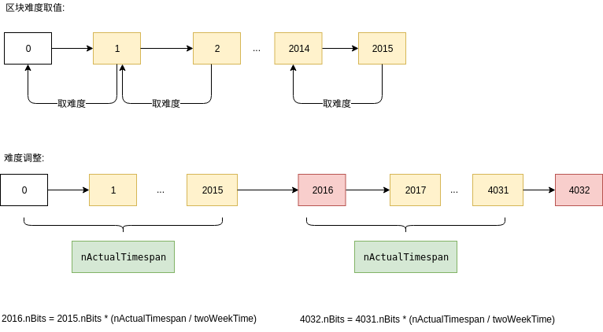
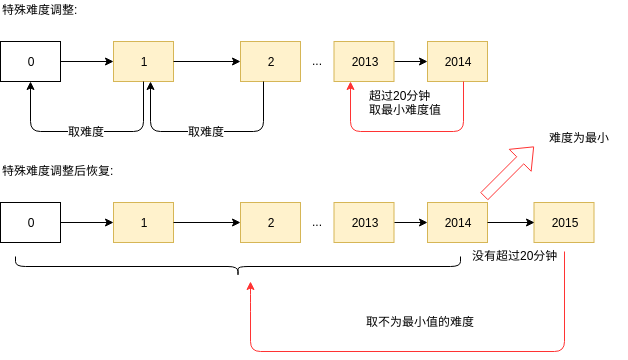

<!-- TOC -->

- [1. 说明](#1-说明)
- [2. nBits与target的转换](#2-nbits与target的转换)
    - [2.1. SetCompact](#21-setcompact)
    - [2.2. GetCompact](#22-getcompact)
- [3. difficulty](#3-difficulty)
- [4. hash rate](#4-hash-rate)
- [5. 难度调整](#5-难度调整)
    - [5.1. CMainParams (主网)](#51-cmainparams-主网)
    - [5.2. CTestNetParams(测试网络)](#52-ctestnetparams测试网络)
    - [5.3. CRegTestParams(本地测试网络)](#53-cregtestparams本地测试网络)
- [6. 主网难度取值](#6-主网难度取值)
- [7. 常见挖矿设备参数](#7-常见挖矿设备参数)
- [8. 参考资料](#8-参考资料)

<!-- /TOC -->

<a id="markdown-1-说明" name="1-说明"></a>
# 1. 说明

```c++
CBlockHeader

int32_t nVersion;
uint256 hashPrevBlock;
uint256 hashMerkleRoot;
uint32_t  nTime;
uint32_t nBits;
uint32_t nNonce; 
```

在比特币源码中,nBits小小4个字节其实包含了很多重信息,其可以转换成的信息有:

* target, 难题的答案范围 (<= target为解)
* difficulty, 难题的难度
* Chainwork, 链上累计的所有hash次数(可以转换成电力,矿机,成本)
* hashrate, 使用不同设备,达到600s(10分钟)出块时间需要达到的hash速度 (hashes/s)


* https://btc.chaintools.io/ (浏览器)

<a id="markdown-2-nbits与target的转换" name="2-nbits与target的转换"></a>
# 2. nBits与target的转换

源码:
```bash
# nBits => target
arith_uint256::SetCompact

# target => nBits
arith_uint256::GetCompact
```


<a id="markdown-21-setcompact" name="21-setcompact"></a>
## 2.1. SetCompact


`含义:`

将uint32_t nBits 以浮点数的方式表示成"uint256_t" target

公式:
N = (-1^sign) * mantissa * 256^(exponent-3)

* 8bit exponent, 指数
* 1bit sign, 正负符号位
* 23bit mantissa, 尾数


`256^(exponent-3)含义:`

256变成二进制是1 00000000,表示向左移动(exponent-3)个byte.  
而代码中是<<= 8 * (exponent - 3); 其含义与 256 ^ (exponent - 3) 相同,都为左移字节的个数


`为什么是256^(exponent-3),而不是256^(exponent),-3表达了什么:`

移动到的最终值是uint256_t = 64hex = 32byte, 而尾数mantissa表达的范围是6hex,也就是3byte.  
假设场景:  
尾数mantissa=0x7fffff,指数exponent=5,那么 <<= 8 * (exponent - 3);得到的结果是:  
0x7fffff * 256^2 = 0x7fffff+2字节的"0" = 0x7fffff + 0000, 其hex数值一共占据了5个字节.   
通过上面的场景的推断,可以明白exponent表示总体占据的字节数,包括了3byte的mantissa本身,所以左移时要-3.  


`负数和溢出的判断:`

```bash
# pfNegative == true,需要同时满足以下条件,表示为负数
mantissa != 0 && (nBits & 0x00800000) != 0

# 含义是: 1. 尾数有值 2. 符号位是1 ,表示负数

# pfOverflow == true,需要同时满足以下条件,表示溢出
mantissa != 0 && ((exponent > 34) || 
(mantissa > 0xff && exponent > 33) || 
(mantissa > 0xffff && exponent > 32));

# 含义是:
# 尾数 <= 0xff, 可以往左移动(34 - 3), 31 + 1 = 32字节
# 0xff < 尾数 <= 0xffff, 可以往左移动(33 - 3), 30 + 2 = 32字节
# 0xffff < 尾数 , 可以往左移动32 字节
```


`python实现:`
```python
def nbits2target(nBits):
	
	exponent = nBits >> 24
	
	mantissa = nBits & 0x007fffff
	
	rtn = 0
	
	if (exponent <= 3):
		mantissa = mantissa >> (8 * (3 - exponent))
		rtn = mantissa
	else:
		rtn = mantissa
		rtn = rtn << (8 * (exponent - 3))
		
	pfNegative = mantissa != 0 and (nBits & 0x00800000) != 0
	
	pfOverflow = mantissa != 0 and ((exponent > 34) or
            (mantissa > 0xff and exponent > 33) or
            (mantissa > 0xffff and exponent > 32))
	
	return rtn
	

def nbits2target_str(nBits):
	target = nbits2target(nBits)
	
	target_str = '%x' % target
	target_str = "0x" +  "0" * (64 - len(target_str)) + target_str
	print("%s" % target_str)

# 使用:
nbits2target_str(0x1d00ffff)
```


<a id="markdown-22-getcompact" name="22-getcompact"></a>
## 2.2. GetCompact

含义:

将uin256_t的target返回到uint32_t的nBits


python实现:

https://github.com/daraosn/blockexplorer/blob/master/bin/getcompact.py

```python
import struct
import sys

def tompi(n):
        if n == 0:
                return struct.pack(">I", 0)
        r = ""
        neg_flag = bool(n < 0)
        n = abs(n)
        while n:
                r = chr(n & 0xFF) + r
                n >>= 8
        if ord(r[0]) & 0x80:
                r = chr(0) + r
        if neg_flag:
                r = chr(ord(r[0]) | 0x80) + r[1:]
        datasize = len(r)
        return struct.pack(">I", datasize) + r

def target2bits(target):
        mpi = tompi(target)

        # exponent is length
        exponent = len(mpi) - 4
        nBits = (exponent & 0xFF) << 24

        # mantissa is char in string
        if exponent >= 1:
                nBits |= (ord(mpi[4]) << 16)
        if exponent >= 2:
                nBits |= (ord(mpi[5]) << 8)
        if exponent >= 3:
                nBits |= (ord(mpi[6]) << 0)
        return nBits
        
def target2bits_str(target):
        nBits = target2bits(target)
        
        print("%x" % nBits)

# 使用:
target2bits_str(0x00000000FFFF0000000000000000000000000000000000000000000000000000)
```


<a id="markdown-3-difficulty" name="3-difficulty"></a>
# 3. difficulty

源码:
```bash
# nBits => diffculty
GetDifficulty

# diffculty => nBits
bitcoin源码未实现
```


`难度累计的算法:`


以创世难度为起点(尾数0x00ffff左移动 (29-3)byte )  (浮点数)

* 尾数向右扩散(难度增加1字节,diff就乘以256)
* 尾数向左扩散(难度减少1字节,diff就除以256)

创世区块的难度为: 0x0000ffff / 0x00ffff  * 难度累计(无) =  1


`而 bitcoin wiki的公式是:`

difficulty = difficulty_1_target / current_target

也就是:
difficulty = ( 0x00ffff << (29-3)byte )  / ( 尾数 << (exponent-3)byte )

其实含义与上面的难度累计算法是一致的, 只要达到:

* (尾数,指数) 变大,难度变小
* (尾数,指数) 变小,难度变大


`bdiff,pdiff:`

矿池pdiff(pool diffculty)一般使用未截断的target作为基准:  
0x00000000FFFFFFFFFFFFFFFFFFFFFFFFFFFFFFFFFFFFFFFFFFFFFFFFFFFFFFFF

而bdiff使用截断的target作为基准:  
0x00ffff << (29-3)byte


`最大难度:`  

target=0,但是因为计算不出来没有意义. 只能算一个大致最大难度,   
难度累计: 256^28(2^224)左右,还要加上尾数的变化. 也就是占据了1个字节的target


`最小难度:`  

因为主网最小target的限制,最小难度为1


`python实现:`
```python
def getdiffculty(nBits):
	
	exponent = (nBits >> 24) & 0xff
	
	# ddiff = 0x0000ffff / (nBits & 0x0000ffffff)
	
	ddiff = 65535.0 / (1.0 * (nBits & 0x0000ffffff))
	
	while (exponent < 29):
		ddiff *= 256.0
		exponent += 1
	
	while (exponent > 29):
		ddiff /= 256.0
		exponent -= 1
		
	return ddiff
	
def getdiffculty_str(nBits):
        ddiff = getdiffculty(nBits)

        print("%x => %f" % (nBits, ddiff))

# 使用:

getdiffculty_str(0x1d00ffff)	
```


<a id="markdown-4-hash-rate" name="4-hash-rate"></a>
# 4. hash rate

难度1的偏移:
```python
0xffff * 2 ** 208
# 也就是:

0x00ffff * 1 << 26(byte)
```

难度D的偏移:
```python
（0xffff * 2 ** 208）/ D
```

要找到难度D的预期哈系数:
```python
D * 2 ** 256 /（0xffff * 2 ** 208）

# 也就是:
D / （0xffff * 2 ** 208） * 2 ** 256

# 含义是:
# 找到D偏移难度中的一个的概率 * 32字节数字的穷举数.
# 即找到一个满足D偏移难度的数字要经过多少次hash.
```

简化一下:
```python
D * 2 ** 48 / 0xffff
```

出块时间是10分钟,也就是600s,意味着网络哈系率是:
```python
D * 2 ** 48 / 0xffff / 600
```

简化一下:
```python
D * 2 ** 32 / 600
```

难度1时:
```python
1 * 2 ** 32 / 600 = 7158278, 约7M hashes / s
```

难度为6.653 x 10^12时 高度551,687:
```python
6.653 * 10 ** 12 * 2 ** 32 / 600 = 47,624,029,033,813,336,064

# 也就是47.624E HASHS/s 才能够寻找到解
```

自己单独挖(明确了效率)要多久才能生成一个区块:
```python
time = D * 2 ** 32 / hashrate
```

使用1G hash/s 的设备生成一个20000难度的区块需要多久?
```python
20000 * 2 ** 32 / 10 ** 9 / 60 / 60 = 23 小时
```


python实现:
```python
# 蚂蚁s9: 14,000,000 Mhash/s  (14T)
# Core i7 3930k: 66 Mhash/s
# Tesla S2070: 749 Mhash/s

def hashrate_str(ddiff):
        asic_s9 = 14000000000.0
        cpu_i7 = 60000000.0
        gpu_s2070 = 749000000.0
        
        print("total hashes: %d" %  (ddiff * 2 ** 32))
        print("10min one block need rate: %d hashes/s" % (ddiff * 2 ** 32 / 600))
        print("asic_s9 solo need: %f s" % (ddiff * 2 ** 32/asic_s9))        
        print("cpu_i7 solo need: %f s" % (ddiff * 2 ** 32/cpu_i7))
        print("gpu_s2070 solo need: %f s" % (ddiff * 2 ** 32/gpu_s2070))


# 给定 1. 出块时间 2. hash速度 , 求出难度 (固定单台设备挖矿时间所用的难度)

def calcdiff_str(blocktime, rate):
        # D * 2 ** 32 / blocktime = rate
        # D = blocktime * rate / 2 ** 32
        
        print( "%f" % (blocktime * rate / 2 ** 32))

# 使用:
hashrate_str(1)

calcdiff_str(600.0, 7158278.0)   
```


<a id="markdown-5-难度调整" name="5-难度调整"></a>
# 5. 难度调整

源码:
```bash
generate -> generateBlocks -> BlockAssembler::CreateNewBlock 

pblock->nBits  = GetNextWorkRequired(pindexPrev, pblock, chainparams.GetConsensus());

class CMainParams : public CChainParams:

# 难度调整区间理应花费的时间(2周)
consensus.nPowTargetTimespan = 14 * 24 * 60 * 60;

# 出块时间(10分钟)
consensus.nPowTargetSpacing = 10 * 60; 

# 难度调整区间的理应区块高度累计(2016块)
int64_t DifficultyAdjustmentInterval() const { return nPowTargetTimespan / nPowTargetSpacing; }
```
    
<a id="markdown-51-cmainparams-主网" name="51-cmainparams-主网"></a>
## 5.1. CMainParams (主网)


`难度公式:`

新的难度 = 旧的难度 * (过去2016区块的时间 / 两周时间)

限制1:   
过去2016区块的时间会调整为[两周时间/4,两周时间*4]之内,也就是难度会限制在增长/减少4倍之内

限制2:  
难度不会低于设置的最小难度值


`公式的理解:`

按照正常的思路,应该是 新难度 / 旧难度 = 固定时间(2周) / 旧时间. 使得求出2周时间出块理应的新难度. 不过这个思路为什么会和代码中的公式有差别呢?

我们假设一个场景: 

* 旧nBits =  0x1d00ffff
* 过去时间 = 1周

那么求出:

* 新nBits = 2 * 0x1d00ffff

那么逻辑就会产生问题了:

我们此时的出块时间是1周,我们想要使难度增大以致区间出块时间变为2周. 而nBits越大,其对应的求解难度越小(范围限制变小了),所以调整后的区间出块时间会变为0.5周.

综上我们要把等式右边的分子分母互换以适应这样的逻辑.


`打印调整区块难度的块数:`
```python
# 当前区块高度是552481, 打印540000后难度调整的区块并与区块链浏览器做对比

nPowTargetTimespan = 14 * 24 * 60 * 60
nPowTargetSpacing = 10 * 60
interval = nPowTargetTimespan / nPowTargetSpacing # (2016)

def print_adjustblock(beginblock, adjustblocknum):
        if beginblock % interval != 0:
                beginblock  += interval - (beginblock % interval)
        i = beginblock
        while i < beginblock + adjustblocknum * interval:
                print(i)                
                i += interval

print_adjustblock(540000, 10)
```

`手动计算难度调整:`
```python
# 举例:
# 调整难度块: 552384 Bits: 389142908, Time: 1543838368
# 起始块: 550368 Bits: 388648495, Time: 1542412284
# 终止块: 552383 Bits: 388648495, TIme: 1543837587
# nbits2target 与 target2bits函数请翻阅上文

nPowTargetTimespan = 14 * 24 * 60 * 60

def getnextworkrequired(oldbits, begintime, endtime):
        actual_timespan = endtime - begintime
        
        if actual_timespan < nPowTargetTimespan / 4:
                actual_timespan = nPowTargetTimespan / 4
        if actual_timespan > nPowTargetTimespan * 4:
                actual_timespan = nPowTargetTimespan * 4

        new = nbits2target(oldbits)
        
        # 请注意,如果结果算得不对,那么可能是难度太小
        # 使得bitcoin的arith_uint256截位了
        new *= actual_timespan
        new /= nPowTargetTimespan
        
        # 忽略最小难度
        
        return target2bits(new)

def getnextworkrequired_str(oldbits, begintime, endtime):
        newnBits = getnextworkrequired(oldbits, begintime, endtime)
        print("%x" % newnBits)

getnextworkrequired_str(388648495, 1542412284, 1543837587)
```

<a id="markdown-52-ctestnetparams测试网络" name="52-ctestnetparams测试网络"></a>
## 5.2. CTestNetParams(测试网络)




情况1:  
当前生成区块与上一区块的时间间隔超过20分钟,则难度取为设置的最小难度值

情况2:  
当生成区块与上一区块的时间间隔不超过20分钟时,恢复难度


<a id="markdown-53-cregtestparams本地测试网络" name="53-cregtestparams本地测试网络"></a>
## 5.3. CRegTestParams(本地测试网络)


情况1与情况2和上述相同


<a id="markdown-6-主网难度取值" name="6-主网难度取值"></a>
# 6. 主网难度取值


`最小难度值:`  
target: "00000000ffffffffffffffffffffffffffffffffffffffffffffffffffffffff"  
转换成nBits会截断: 0x1d00ffff  

`创世区块难度值:`  
target: "00000000FFFF0000000000000000000000000000000000000000000000000000"  
nBits: 0x1d00ffff

<a id="markdown-7-常见挖矿设备参数" name="7-常见挖矿设备参数"></a>
# 7. 常见挖矿设备参数

* Mhash/s 每秒多少兆哈系计算次数
* Mhash/J 每焦耳多少兆哈系计算次数, 1 J = 1 W*s
* Mhash/s/$ 每刀可以买多少哈系速率
* Watts 功率
* Price 价格

<a id="markdown-8-参考资料" name="8-参考资料"></a>
# 8. 参考资料

* https://en.bitcoin.it/wiki/Difficulty (包含上面所有的信息)
* https://blockexplorer.com/api/status?q=getDifficulty (当前难度)
* http://bitcoin.sipa.be/ (历史曲线)
* https://en.bitcoin.it/wiki/Mining_hardware_comparison (矿机比较)
* https://www.nicehash.com/profitability-calculator (收益计算)

