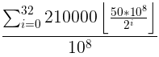

<!-- TOC -->

- [1. 说明](#1-说明)
- [2. 参考资料](#2-参考资料)

<!-- /TOC -->

<a id="markdown-1-说明" name="1-说明"></a>
# 1. 说明

比特币初始的货币供应量是成功计算出难题解者获得50亿聪比特币的奖励.每产生21万个区块(10min/块大约需要4年)后,奖励呈几何减少:

* 第一个大约4年,块[0,210000) 奖励: 5000000000 >> 0 = 5000000000 (聪)
* 第二个大约4年,块[210000,420000) 奖励: 5000000000 >> 1 = 2500000000 (聪)
* ...

`求和公式计算总供应量(为什么n=32,因为32时的奖励为1聪,再/2奖励便没了):`  



`源码的实现:`

在比特币源码中,总量(2100万亿聪)并非是直接设置的,而是由每21万块减半奖励所推理得到的


`相关源码:`  
```bash
class CMainParams : public CChainParams:

# 创世区块的50亿聪比特币的奖励 (50 * COIN)
genesis = CreateGenesisBlock(1231006505, 2083236893, 0x1d00ffff, 1, 50 * COIN);

# 减半周期是210000个块, 210000.0 * 10 / 60 / 24 /365 = 4  (大约4年减半一次)
consensus.nSubsidyHalvingInterval = 210000;

# 减半的逻辑
GetBlockSubsidy
```

总量计算:
```python
from decimal import *

COIN = 10 ** 8        
base_reward = 50 * COIN
adjust_section = 210000
all_sectio_num = 33

def get_decimal_str(num):
        return "{0:.8f}".format(((Decimal(num) / COIN).quantize(Decimal('0.00000000'))))
        
sum = 0
     
for i in range (0, all_sectio_num):
    nSubsidy = base_reward
    nSubsidy = nSubsidy >> i
    sum += adjust_section * nSubsidy

print("sum: %s" % sum)
print("sum decimal: %s" % get_decimal_str(sum))
```

分阶段打印:
```python
from decimal import *

sum = 2099999997690000
COIN = 10 ** 8        
base_reward = 50 * COIN
adjust_section = 210000
all_sectio_num = 33 + 1

def get_decimal_str(num):
        return "{0:.8f}".format(((Decimal(num) / COIN).quantize(Decimal('0.00000000'))))
        
def percentage(a, b):
    if (abs(1.0 * b - 0.0) < 0.000001):
        return "infinite"
    else:
        return ("%.8f%%" % (1.0 * a / b * 100))

summined = 0


print("%10s %10s %18s %18s %18s %18s %18s %18s" % ("Block", "Reward Era", "BTC/block", "Start BTC", "BTC Added", "End BTC", "BTC Increase", "End BTC % of Limit"))

for i in range(0 , all_sectio_num):
    block = i * adjust_section
    
    nSubsidy = base_reward
    nSubsidy = nSubsidy >> i
    currentmined = adjust_section * nSubsidy 
    endedbtc = summined + currentmined
    
    increase = percentage(currentmined, summined)
    endedbtcoflimit = percentage(endedbtc, sum)

    print("%10d %10d %18s %18s %18s %18s %18s %18s" %(block, i+1, get_decimal_str(nSubsidy), get_decimal_str(summined), get_decimal_str(currentmined), get_decimal_str(endedbtc), increase, endedbtcoflimit))

    summined = summined + currentmined

```

理论时间推算(以实际为准):

比特币的减半是由明确的210000个区块数量决定的.而每4年奖励减半只是根据这个前提所推断出来的.根据以下脚本推算出如果挖矿算力保持不变,大约2140年所有的比特币都会被开采完毕

```python
from decimal import *
import datetime

sum = 2099999997690000
COIN = 10 ** 8        
base_reward = 50 * COIN
adjust_section = 210000
all_sectio_num = 33 + 1
beginepoch = 1231006505 # GMT+08:00: 2009年1月4日星期日凌晨2点15分

oneyear = 60 * 60 * 24 * 365 

def get_decimal_str(num):
        return "{0:.8f}".format(((Decimal(num) / COIN).quantize(Decimal('0.00000000'))))
        
def percentage(a, b):
    if (abs(1.0 * b - 0.0) < 0.000001):
        return "infinite"
    else:
        return ("%.8f%%" % (1.0 * a / b * 100))

# GMT+08:00
def getepochstr(epoch):
    return datetime.datetime.fromtimestamp(epoch).strftime('%Y-%m-%d')

current_epoch = beginepoch

summined = 0

print("%15s %10s %10s %18s %15s %18s %18s %18s %18s %18s" % ("Date reached", "Block","Reward Era", "BTC/block", "Year (estimate)", "Start BTC", "BTC Added", "End BTC", "BTC Increase", "End BTC % of Limit"))

for i in range (0, all_sectio_num):
    # 每一轮打印4年
    
    for j in range(0, 4):
        block = i * adjust_section + adjust_section/4 * j
        nSubsidy = base_reward
        nSubsidy = nSubsidy >> i

        currentmined = adjust_section / 4  * nSubsidy 
        endedbtc = summined + currentmined
        
        increase = percentage(currentmined, summined)
        endedbtcoflimit = percentage(endedbtc, sum)
        
        estimate = current_epoch + oneyear

        print("%15s %10d %10d %18s %15s %18s %18s %18s %18s %18s" % (getepochstr(current_epoch), block, i+1, get_decimal_str(nSubsidy), getepochstr(estimate), get_decimal_str(summined), get_decimal_str(currentmined), get_decimal_str(endedbtc),increase, endedbtcoflimit))

        current_epoch = current_epoch + oneyear

        summined = summined + currentmined
```


<a id="markdown-2-参考资料" name="2-参考资料"></a>
# 2. 参考资料

* https://en.bitcoin.it/wiki/Controlled_supply

