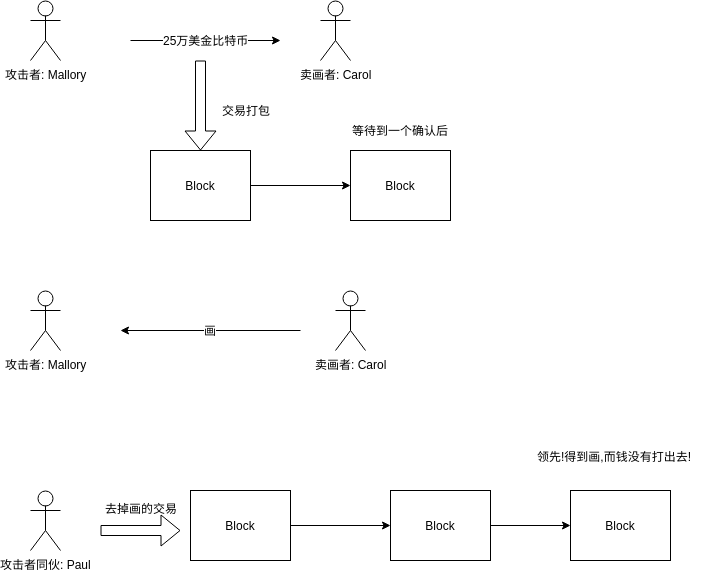
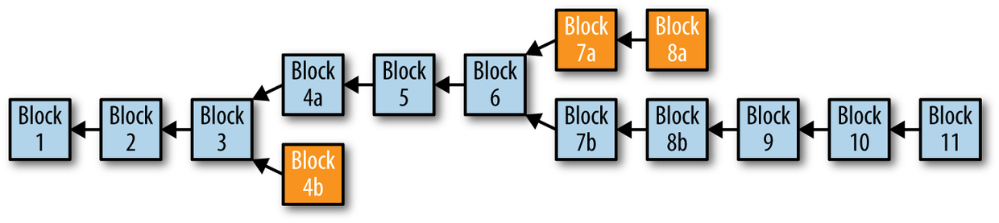
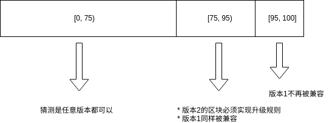
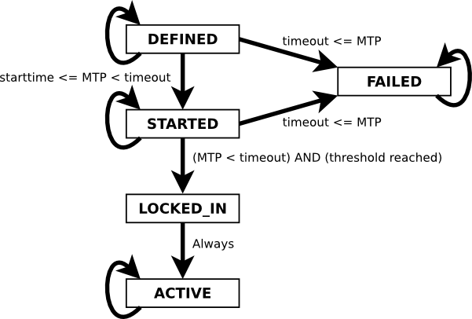

<!-- TOC -->

- [1. 算力增长](#1-算力增长)
- [2. 随机源](#2-随机源)
- [3. 单机矿工节点挖矿](#3-单机矿工节点挖矿)
- [4. 挖矿案例](#4-挖矿案例)
- [5. 共识攻击](#5-共识攻击)
- [6. 硬分叉](#6-硬分叉)
    - [6.1. 分叉之后难度的影响](#61-分叉之后难度的影响)
    - [6.2. 争议](#62-争议)
- [7. 软分叉](#7-软分叉)
    - [7.1. 争议](#71-争议)
    - [7.2. BIP-34 / 66 / 65](#72-bip-34--66--65)
    - [7.3. BIP-9](#73-bip-9)
- [8. 共识软件](#8-共识软件)

<!-- /TOC -->


<a id="markdown-1-算力增长" name="1-算力增长"></a>
# 1. 算力增长


<a id="markdown-2-随机源" name="2-随机源"></a>
# 2. 随机源


* 早期通过`遍历随机数(Nonce)`获得符合要求的hash来挖出一个块
* 难度增长后,尝试了40亿个值仍然没有出块 --- `变化区块头的时间戳`
* 当挖矿硬件的速度到达了4GH/秒,时间戳+nonce的取值在一秒就被用尽了.很快达到TH/秒速率后,`时间戳延后` (不能延的太多)
* `coinbase交易`作为`额外`的`随机值来源`,因为coinbase脚本可以存储`2-100字节`的数据

8个`额外`的随机数(coinbase脚本的修改导致merkle树根的修改) 加上4个字节的`标准`的随机数(nonce),允许用户尝试`2^96`种可能性而`无需修改时间戳`

<a id="markdown-3-单机矿工节点挖矿" name="3-单机矿工节点挖矿"></a>
# 3. 单机矿工节点挖矿

* rpc 节点指定 maxtries , 默认100w次之后结束当次挖矿
* 当尝试[0, 65535]范围内的nNonce之后,尝试生成新的区块(新的时间戳)

<a id="markdown-4-挖矿案例" name="4-挖矿案例"></a>
# 4. 挖矿案例

假设一名矿工已经购买了算力共14,000GH/S,`分叉之后对于难度有什么影响? `H/S`,在2017年,它的价值大约`2500美元`.设备功率为`1.3`千瓦(KW),每日耗电`32度`,每日平均成`分叉之后对于难度有什么影响? `美元.该矿工solo方式挖出一个块平均需要4年.如果这个矿工确实在这个`时限内挖出`一个区块,奖励`12.`分叉之后对于难度有什么影响? `特币,可以得到12,500美元的奖励(2017年10月22日).这甚至不能覆盖整个`硬件`和整个时间段的`电力``分叉之后对于难度有什么影响? `亏损约为`1000美元`.而且在4年内能否挖出一个块主要靠矿工的`运气`.有可能4年终得到两个块,获得`非常大的利润`.可能5年都找不到一个块,从而`遭受经济损失`.


`矿池的目的`: 汇集数以千计参与者们的算力并分享奖励,通过参加矿池,矿工们得到整体回报的一小部分,但通常每天都能得到,因而`减少了不确定性`.

`矿池`的分配工作及发放奖励的`可能原理`: 骰子游戏的比喻: 如果骰子玩家的`目的是扔骰子结果都小于4`,矿池可以设置一个更容易的目标,`统计`有多少次池中的玩家扔出的结果`小于8`,当玩家扔出的结果小于8,他们得到份额.同样,一个矿池会将矿池难度设置在保证`一个单独的矿工`能够`频繁`地找到一个`符合矿池难度`的区块头hash来赢取`份额`.

托管矿池: 有一个公司或者个人经营一个矿池服务器.矿工连接到矿池服务器采用一个采矿协议比如`Stratum(STM)`或者`GetBlockTemplate(GBT)`.

P2P矿池: 将矿池服务器的功能去中心化,实现一个并行的类似区块连的系统,名叫`份额连(share chain)`.在P2Pool中,单独的矿工创建自己的候选区块,打包交易,非常`类似于solo矿工`,但是他们`在份额链上合作采矿`.


<a id="markdown-5-共识攻击" name="5-共识攻击"></a>
# 5. 共识攻击

共识攻击不能从其他的钱包那里

* 偷到比特币
* 不签名地支付比特币
* 重新分配比特币
* 改变过去的交易
* 改变比特币持有的记录

攻击只有:

* 制造区块连`分叉`来实现`双重支付`
* 拒绝服务的方式来`阻止特定的交易`或者公司`特定的钱包地址`




整个过程中Paul矿池里的其他矿工可能自始自终都没有察觉到这笔`双重支付`交易有什么一样,因为挖矿程序都是在自动运行,并且不会时时监控没一个区块中的每一笔交易

本质上来看,共识攻击就像是系统中所有矿工的算力被分成了两组,`一组为诚实算力`,`一组为攻击者算力`,两组人都在争先恐后地计算块链上的新块,只是攻击者算力算出来的是精心构造的,包含了或者剔除了某些交易的块.

中心化控制的矿池引入了`矿池操作者`出于利益而施行攻击的风险.`矿池操作者控制了候选块的生成,同时也控制了哪些交易会被放到新生成的块中`.如果这种权利被矿池操作者`微妙而有节制的方式滥用的话`,那么矿池操作者就可以在`不为人知的情况下发动共识攻击并获益.`

也有可能攻击者仅仅是为了`破坏整个比特币系统而发动攻击`,而不是为了利益.这种攻击很有可能来自`政府`资助的组织.


<a id="markdown-6-硬分叉" name="6-硬分叉"></a>
# 6. 硬分叉




短暂的分叉: 网络中的两个部分在段时间内处于区块链的两个不同分支,但是在经过多个块被挖掘之后,网络在一个统一的区块链上重新收敛.

硬分叉: 网络分叉到两条链条,由于共识规则的变化.网络不会重新收敛到单个链路.相反,这两条链`独立发展`.当比特币网络的一部分节点按照与网络的其余部分节点不同的一致性规则运行时,硬分叉就会产生.

硬分叉引入的变化可以被认为`不是向前兼容`的 `(前面的版本可以使用后面的版本产生的数据)`

如上图: 在块高度6处发生了硬分叉,假设原因是由于新共识规则的变化出现`新的客户端版本`.从块高度7开始,矿工运行新的版本,需要`接受新类型的数字签名`,我们称之为`Smores签名`,它不是基于ECDSA的签名.紧接着,运行新版本的节点创建了一笔Smores签名的交易,`一个更新了软件的矿工挖出了包含此交易的区块7b`.

任何尚未升级软件以验证Smores签名的节点或矿工现在都无法处理区块7b,`因为他们无法向前兼容(前面的版本的代码无法处理新的版本的节点产生的数据)`.遵守旧规则的矿工不会处理来传播块7b.最终他们将能够开发区块7a,这个旧的规则是有效的,但是不包含与Smores签名的任何交易.

<a id="markdown-61-分叉之后难度的影响" name="61-分叉之后难度的影响"></a>
## 6.1. 分叉之后难度的影响

例如 `80%-20%的分割`,大多数矿工使用新的共识规则:

新的共识规则拥有80%的以前可用的挖矿的承诺.与上一周期相比,挖矿能力`突然降了20%`,也就是区块将会平均`每12分钟发现一次`,直到2016块开采,这大约需要24,192分钟或16.8天. 2016个区块后,基于此链中哈希算力减少,难度会将(减少20%)每10分钟产生一个区块.

少数人认可的那条链,根据旧规则继续挖矿,`现在只有20%的哈希算力`,将面临更加艰巨的任务.平均每隔50分钟开采一次,这个难度也同样会在2016个块后进行调整,这将需要100,800分钟,`或大约10周的时间.`假设每个块具有固定的容量,`这也将导致交易容量减少5倍`,因为每小时可用于记录交易的块大幅度减少了.

<a id="markdown-62-争议" name="62-争议"></a>
## 6.2. 争议

缺点:

* 迫使少数人被迫选择升级或是必须保留在少数派的链条上
* 将整个系统分为两个竞争的系统的风险被许多人认为是不可接受的风险

优点:

* 避免了技术债务,并与过去提供了一个干净的了断


<a id="markdown-7-软分叉" name="7-软分叉"></a>
# 7. 软分叉

并非所有的共识规则的变化都会导致硬分叉,只有`前向不兼容`的共识规则才会导致分叉.如果共识规则的改变能够让未修改的客户端仍然`按照先前的规则对待交易或区块`,那么`就可以在不进行分叉的情况下实现共识修改`.这就是软分叉,来区分之前的硬分叉,实际上软分叉不是分叉,`软分叉是共识规则的前向兼容并作些变化`,`允许未升级的客户端继续与新规则同时工作.`

软分叉升级`只能用于增加共识规则约束,而不是扩展它们`.软分叉可以通过多种方法实现,该术语不定义单一方法,而是一组方法,它们都有一个共同点: 他们`不要求所有节点升级或强制非升级节点必须脱离共识`.

例如: BIP-65 (CHECKLOCKTIMEVERIFY) 重新解释了NOP2操作码.`实施BIP-65的客户将NOP2解释为OP_CHECKLOCKTIMEVERIFY.` 并在其锁定脚本中包含该操作码的UTXO上,强制了绝对锁定实践的共识规则.这种变化是一个软分叉,因为在BIP-65中有效的交易在任何没有实现BIP-65的客户端上也是有效的.对于旧的客户端,该脚本包含一个NOP代码,而被忽略.

Segwit最初被设想为硬分叉升级,因为它修改了一个基本的交易结构.在2015年11月,一位是从事比特币核心工作的开发人员提出了一种机制,通过这种机制可以将软件包引入segwit.`引入segwit就是软分叉,而不需要每个节点必须从链上升级或拆分网络.`有可能还有其他尚未被发现的机制,通过这种机制可以向前兼容的方式进行升级,都作为软分叉.

<a id="markdown-71-争议" name="71-争议"></a>
## 7.1. 争议

缺点:

* 技术债务,`由于软分叉在技术上比硬分叉升级更复杂`,所以引入了技术性债务,这是指由于过去的设计权衡而增加代码维护的未来成本.代码复杂性增加了错误和安全漏洞的可能性.
* 由于错误而不得不被回退的失败的软分叉几乎肯定会导致资金的流失


<a id="markdown-72-bip-34--66--65" name="72-bip-34--66--65"></a>
## 7.2. BIP-34 / 66 / 65

BIP-34定义了一个共识规则的变更,要求将Coinbase交易的in字段包含`块高度`.
* 在BIP-34之前,coinbase可以让矿工选择包含的任意数据.
* 在BIP-34激活之后,有效块必须在coinbase的开始处包含特定的块高度,`并且使用大于或等于"2"`的版本号进
行标识

```c++
coinbaseTx.vin[0].scriptSig = CScript() << nHeight << OP_0;
```

最后一个version为1的区块(227835高度): 
https://www.blockchain.com/zh/btc/block-height/227835


基于`1000个块的滚动窗口`定义了`两步启动机制`.矿工将以2作为版本号来构建块,从而向BIP-34发出信号:
* 如果75%(最近1000个块中的750个)标有版本2,则版本2必须包含conbase交易中的块高度,否则被拒绝为无效.`版本1块仍然被网络接受`,不需要包含块高度.
* 当95%是版本2是,版本1不再被视为有效

也就是
* 当最近1000个区块的75%为版本2 [75,95)% => 1. `版本2`的区块数据必须实现升级规则 2. 版本1同样被兼容
* 当最近1000个区块的95%为版本2 [95,100]% => 版本1不再被兼容



---
https://bitcoin.org/en/developer-reference#block-versions

* BIP-34   版本2 Heght in Coinbase
* BIP-66   版本3 Strict DER signatures  
* BIP-64   版本4 OP_CHECKLOCKTIMEVERIFY  

<a id="markdown-73-bip-9" name="73-bip-9"></a>
## 7.3. BIP-9

之前的34,66,65使用的机制虽然成功地激活了三个软分叉.但是机制的缺点如下:
* 通过使用块版本的`整数值`,`一次只能激活一个软分叉`,需要软分叉提议之间协调对其优先级和排序的协议
* 块版本的增加,`没有提供一种直接的方式来拒绝变更`

BIP-9 将会克服这些挑战,将块版本字段解释为bit字段而不是一个整数,因为版本2,3,4的占用,所以只剩下29位可用做位字段.

与BIP-34不同,BIP-9根据2016块的难度改变目标周期,在整个间隔中计数激活型号.如果提案的信号块的总和超过`95%(2016中的1916)`,则该天将在稍后的改变目标期间激活.



* BIP-68,112,113 CHECKSEQUENCEVERIFY
* BIP-141,143,147 SEGWIT

<a id="markdown-8-共识软件" name="8-共识软件"></a>
# 8. 共识软件

去中心化制度: 不存在将权力强加于网络参与者的"权威".权力分散在多个支持者,如矿工,核心开发商,交易所,商家和最终用户之间.`这些支持者不能单方面作出决定`.

软分叉的95%门槛反映了只有在`很大程度上达成一致的情况下,才能有几个变化.`
