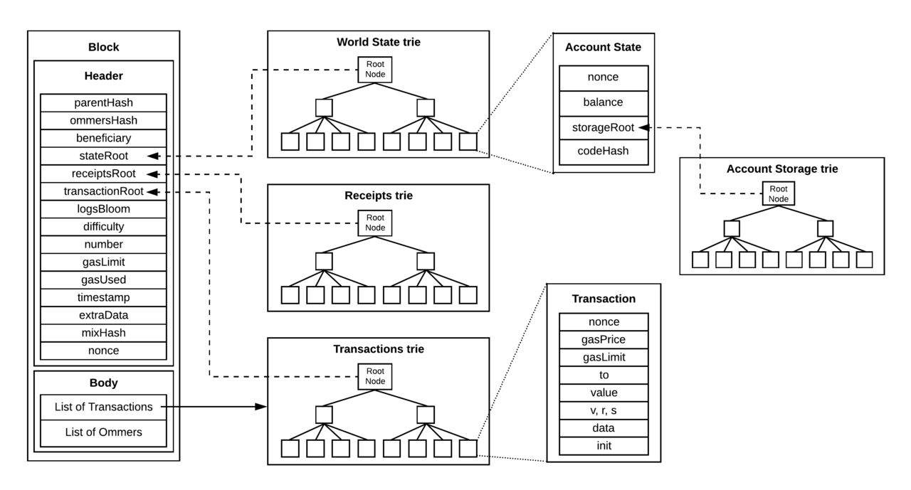

<!-- TOC -->

- [1. 说明](#1-说明)

<!-- /TOC -->

# 1. 说明

在比特币中只有一棵 merkel tree, 对每一个区块的所有交易进行了证明. 为什么有这样的技术存在? 因为区块链要存储所有交易的信息,如果每一个节点都存储了所有的交易信息,那么以目前主流存储设备需要很高昂的代价.

以2019年05月29日的价格来算, 1TB  271.00,存储成本为  0.271 元/G, 而200G比特币的容量大约需要消耗54快钱. 不仅是存储成本大,另外流量成本也是巨大的, 以百兆带宽来算,下载200G的区块数据需要 

```python
200 * 1000 / 11.7 / 60 / 60 = 4.7 小时
```

现在普遍带宽为百兆,即使百兆也要下载4.7 个小时. 对于普通区块链用户来说,这些时间/存储成本是非常高的. 所以钟本聪在写白皮书的时候就提出了问题的解决的方法, 也就是merkle tree, 把所有交易的hash 汇集成一个root hash, 普通用户只需要存储每个区块的头部 80字节即可,

```python
6 * 24 * 365 * 10 * 80 / 1000 / 1000 = 42 MB
```

也就是10年也仅仅产生了42MB的数据, 普通用户仅仅需要知道交易hash的变化,就可以验证转账的合法性. 通过向**多个旁系节点**查询得到merkle tree 旁系分支, 就可以验证指定交易的合法性. 

随之而来的即是utxo, 未花费输出模型, 特点是交易转账不再是传统中心化数据库的资金表,流水表. 而是用连续的碎片数据(从哪里in并且签名证明,out到哪里), 合并成了最后的信息:` 某个账户下有多少钱,只有私钥拥有者签名才可以花费钱.`

utxo的缺点是需要维护索引,否则无法得到上述最后的信息. (比特币在不把地址导入到钱包内就无法查找某个地址下有多少钱,某个地址相关的转账交易)

那同样做成这个事情,可以不用utxo么? 


浏览ethereum的源码, 和比特币有很大的不同. 增加了 1. StateRoot(状态树) 2. ReceiptRoot(收据树).





TODO!!!

按照猜测来说, 每一个区块都包含了一颗状态树, 收据树, 交易树, 这些树都是整体部分的一个碎片,而由碎片拼接成完整的信息. 

状态树, 也就是地址下有多少钱, nonce累积数是多少, 存储树根hash是什么
```go
type Account struct {
	Nonce    uint64
	Balance  *big.Int
	Root     common.Hash // merkle root of the storage trie
	CodeHash []byte
}

type stateObject struct {
    address  common.Address
    addrHash common.Hash
    data     Account
    db       *StateDB
}

type StateDB struct {
	db   Database
	trie Trie
    stateObjects      map[common.Address]*stateObject
}
```

收据树, 交易相关信息的扩展吧!
```go
type Receipt struct {
PostState         []byte
Status            uint64
}
```

交易树, 交易
```go

type Transaction struct {
    data txdata
}

type txdata struct {
    AccountNonce uint64
    Price        *big.Int
    GasLimit     uint64
    Recipient    *common.Address
    Amount       *big.Int
    Payload      []byte 
    V *big.Int
    R *big.Int 
    S *big.Int
}

```

其实初步一看,只需要交易树就可以了,VRS里面有公钥的信息,可以推导出币是哪里来的, Recipient 是收款方, 表示币打给谁. 而Payload可以存储合约的信息．　为什么需要状态树　和　收据树呢? 猜测是维护一个索引?
