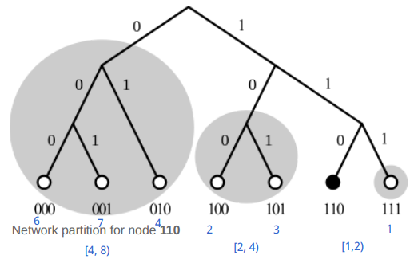
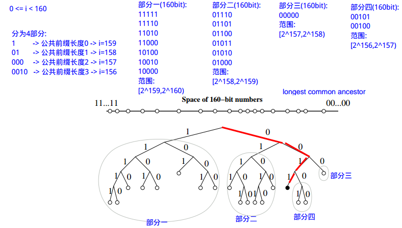

<!-- TOC -->

- [1. 基础信息](#1-基础信息)
- [2. 辅助](#2-辅助)
- [3. 论文示例说明](#3-论文示例说明)
- [4. 实践](#4-实践)
- [5. 参考资料](#5-参考资料)

<!-- /TOC -->

<a id="markdown-1-基础信息" name="1-基础信息"></a>
# 1. 基础信息

Kademlia是点对点计算的分布式哈希表,时间复杂度为`O(log(n))`.  是BitTorrent,I2P,IPFS,区块链运用的p2p技术的底层原理.

从P2P技术发展的角度来说,其解决的问题是`如何快速定位节点的问题`:

* 第一代P2P文件分享网络,像Napster,依赖于`中央数据库`来协调网络中的查询.
* 第二代P2P网络,像Gnutella,使用泛滥式查询(query flooding)来查询文件,它会`搜索网络中所有的节点`.
* 第三代P2P网络使用分布式散列表来查询网络中的文件,` 协议追求的主要目标就是快速定位期望的节点.`

`如何快速定位节点? `

Kademlia基于两个节点之间的距离计算使用的是两个网络节点ID号的异或 `XOR distance`. 由于这个属性,Kademlia搜索的每一次迭代将距目标至少更近1 bit, 一个基本的具有`2^n的节点`的Kademlia网络在最坏的情况下只需`花n步`就可找到搜索的节点或值. -- 每次过滤一半,`时间复杂度为O(log(N))`


`距离计算特性:`

1. d(x,y) = 0: `节点与自身的距离为0`
2. d(x,y) > 0 if x != y, and ∀ x,y : d(x,y) = d(y,x): `x到y的距离与y到x的距离是一样的`
3. d(x,y) + d(y,z) >= d(x,z): `x,y,z组成一个三角形,x,y距离与y,z距离之和大于等于x,z距离`
4. d(x,y) ⊕ d(y,z) = d(x,z): `x,y距离与y,z距离的距离为x,z的距离`


`路由表存储:`

用数组的方式进行存储:
```go
RoutingTable [][]*Node // 160x20
```


根据ID的BIT数决定`路由表数组`的大小.因为原始Kademlia算法使用的是`160bit的随机数字`作为ID的长度,所以`路由表数组`的大小为160.

而`路由表数组`中的元素是`节点数组`,称之为`k-bucket`. 前缀k是一个常量,决定了`节点数组`的大小,一般为20.

节点号放入到`路由表数组`是有规则的.在0 <= i < 160的情况下,`路由表数组`的大小为160,对于不同的i下标的元素, 其中存储了`[2^i, 2^(i+1) )`距离范围的`节点数组`.

维基百科的图片的含义:




`3个bit`长度的号码,自身的节点为`110`,将网络中的节点根据距离范围分为三部分:

* i=0, k桶内存储节点的距离范围为 [1,2)
* i=1, k桶内存储节点的距离范围为 [2,4)
* i=2, k桶内存储节点的距离范围为 [4,8)

`从Longest Common Prefix 的角度思考路由表:`

与自身节点110的最长公共祖先:

* i=0, k桶内存储节点的距离范围为 [1,2)  -> 最长公共祖先长度为 (3 - 0) - 1 = 2 -> 容纳1个节点
* i=1, k桶内存储节点的距离范围为 [2,4)  -> 最长公共祖先长度为 (3 - 1) - 1 = 1 -> 容纳2个节点
* i=2, k桶内存储节点的距离范围为 [4,8)  -> 最长公共祖先长度为 (3 - 2) - 1 = 0 -> 容纳4个节点

由上可见,`距离范围越小,最长公共祖先长度越大`.可以推出公式,最长公共祖先长度为`(bit len - i) - 1`. 不同距离范围的k-bucket,容纳的节点数量的公式为`2^i`

<a id="markdown-2-辅助" name="2-辅助"></a>
# 2. 辅助

```python
def dis(x1, x2):
    return int(x1, 2) ^ int(x2, 2)

dis('11111', '0011')
```

<a id="markdown-3-论文示例说明" name="3-论文示例说明"></a>
# 3. 论文示例说明




如上图,根据之前我们从简单例子中分析出来的经验,来理解


<a id="markdown-4-实践" name="4-实践"></a>
# 4. 实践

prettymuchbryce/kademlia(基于表): 

```bash
# https://github.com/prettymuchbryce/kademlia 

go get github.com/prettymuchbryce/kademlia 

# 目录
/mnt/disk1/go/src/github.com/prettymuchbryce/kademlia 
```

nictuku/dht(基于二叉树): 

```bash
# https://github.com/nictuku/dht 

go get github.com/nictuku/dht

# 目录
/mnt/disk1/go/src/github.com/nictuku/dht
```


<a id="markdown-5-参考资料" name="5-参考资料"></a>
# 5. 参考资料

* https://en.wikipedia.org/wiki/Kademlia (维基百科)
* https://pdos.csail.mit.edu/~petar/papers/maymounkov-kademlia-lncs.pdf (论文)


还不错的分析:

* https://zhuanlan.zhihu.com/p/38425656 (很多错误,将就看看)
* https://www.jianshu.com/p/f2c31e632f1d 
