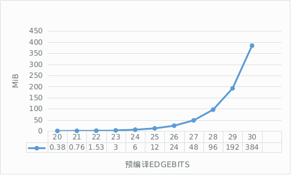
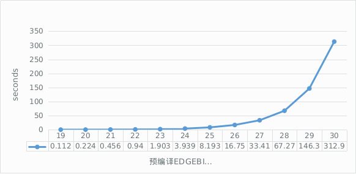
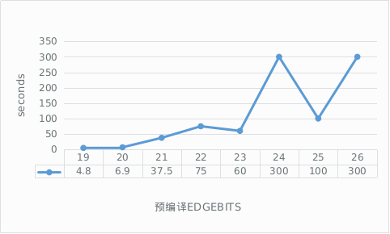
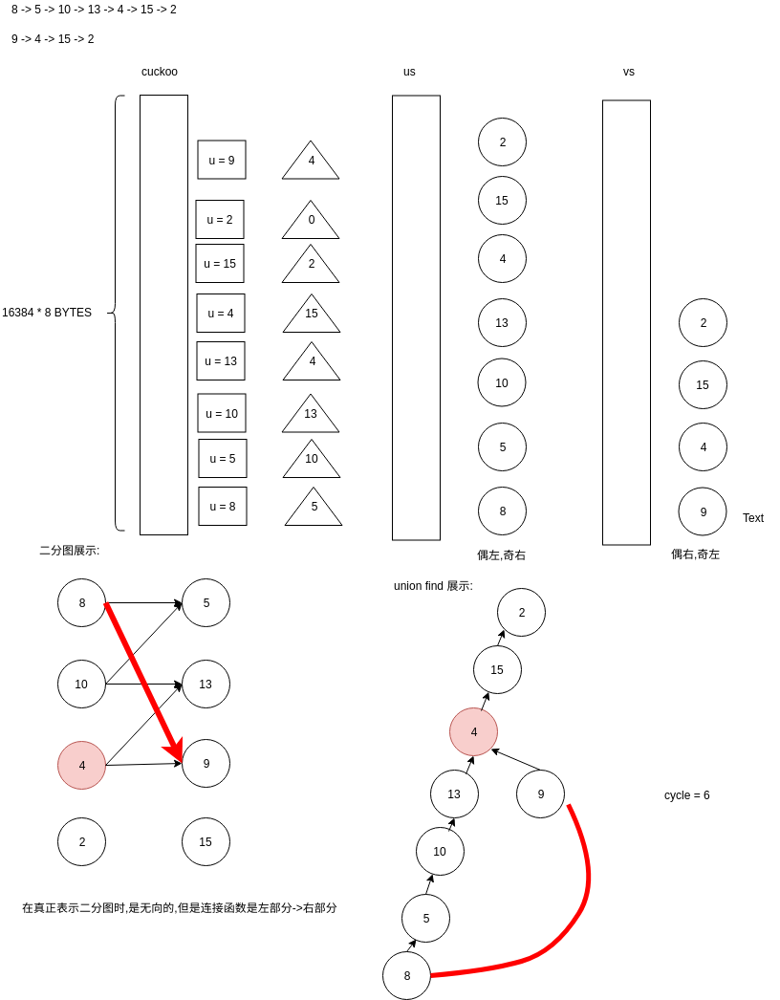
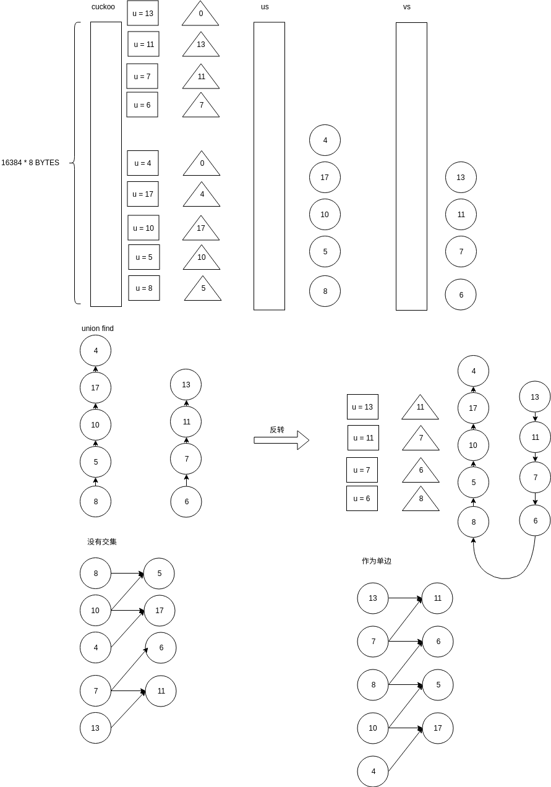

<!-- TOC -->

- [1. 说明](#1-说明)
- [2. lean.hpp (memory latency bound)](#2-leanhpp-memory-latency-bound)
    - [2.1. bench mark](#21-bench-mark)
        - [2.1.1. 所占内存空间与EDGEBITS的关系](#211-所占内存空间与edgebits的关系)
        - [2.1.2. 计算每nonce消耗时间与内存的关系](#212-计算每nonce消耗时间与内存的关系)
        - [2.1.3. 平均找到目标cycle的时间与内存的关系](#213-平均找到目标cycle的时间与内存的关系)
        - [2.1.4. 多线程数量与nonce消耗时间的关系](#214-多线程数量与nonce消耗时间的关系)
        - [2.1.5. 难度调整控制出块时间](#215-难度调整控制出块时间)
- [3. 原理](#3-原理)
    - [3.2. 图的寻找](#32-图的寻找)
    - [3.3. 找不到时](#33-找不到时)

<!-- /TOC -->

<a id="markdown-1-说明" name="1-说明"></a>
# 1. 说明

* https://github.com/tromp/cuckoo
* https://github.com/tromp/cuckoo/blob/master/doc/cuckoo.pdf?raw=true (论文)
* https://grincon.org/ (youtube 视频)

```bash
# 编译
git clone https://github.com/tromp/cuckoo
cd ./cuckoo/src/
export LD_LIBRARY_PATH=$PWD/crypto:$LD_LIBRARY_PATH

# 添加到配置 (服务器测试)
cat >> ~/.bashrc << EOF
export LD_LIBRARY_PATH=$PWD/crypto:\$LD_LIBRARY_PATH
EOF

cd cuckoo
make
```

实现:
* lean.hpp (memory latency bound)
* mean.hpp (memory bandwidth bound)
* lean.cu (NVIDA gpu)
* mean.cu (NVIDA gpu)
* simple.cpp (simple implement)

<a id="markdown-2-leanhpp-memory-latency-bound" name="2-leanhpp-memory-latency-bound"></a>
# 2. lean.hpp (memory latency bound)

宏|默认值|描述
-|-|-
HEADERLEN|80|
PART_BITS|0|
`EDGEBITS`|29|决定图的大小
`PROOFSIZE`|42|寻找到环的length
NEDGES|((word_t)1 << EDGEBITS) (19 - 524288)|
NSIPHASH|1|
SIZEOF_TWICE_ATOM|4|
IDXSHIFT|(PART_BITS + 6) (6)|
PART_BITS|0|

---

常量|默认值|描述
-|-|-
ONCE_BITS|NEDGES >> PART_BITS  (19 - 524288)|
TWICE_BYTES|(2 * ONCE_BITS) / 8  (19 - 131072)|
TWICE_ATOMS|TWICE_BYTES / sizeof(atwice)  (19 - 32768)
NODEBITS|EDGEBITS + 1 (19 - 20)|
MAXPATHLEN| 8 << (NODEBITS/3) (19 - 512)|
CUCKOO_SIZE|NEDGES >> (IDXSHIFT-1) (16384)|
cuckoo| CUCKOO_SIZE*sizeof(au64) (131072)|
CUCKOO_MASK| CUCKOO_SIZE - 1 (16383)|
EDGEMASK| ((word_t)NEDGES - 1) (524287) |
NODEMASK|(EDGEMASK << 1) \| (word_t)1  (1048575)|
---

选项|类型|变量|默认值|描述
-|-|-|-|-
-h|char [HEADERLEN]|`header`|""|80字节被计算对象
-n|uint32_t|`nonce`|0|累计数
-r|uint32_t|range|1|在累计数上累加对少次来解难题
-m|uint32_t|ntrims|1 + (PART_BITS+3)*(PART_BITS+4)/2;|
-t|uint32_t|nthreads|1|多线程数量


```bash
make lean19
#lean19:		../crypto/siphash.h cuckoo.h  lean.cpp Makefile
#   $(GPP) -o $@ -DATOMIC -DEDGEBITS=19 lean.cpp $(LIBS)

./lean19 -n 38

# 42 == PROOFSIZE. 20 == EDGEBITS+1. "" == header. 38 == nonce. 50% == 写死. 7 == ntrims. 1 == nthreads.
Looking for 42-cycle on cuckoo20("",38) with 50% edges, 7 trims, 1 threads

# 64KB == NEDGES/8. 128KB == TWICE_ATOMS*sizeof(atwice). 1 == NSIPHASH. 4 == SIZEOF_TWICE_ATOM.

Using 64KB edge and 128KB node memory, 1-way siphash, and 4-byte counters

# 524288 == NEDGES.
initial size 524288

round  1 partition sizes U0 331665 V0 155517
round  2 partition sizes U0 92055 V0 61347
round  3 partition sizes U0 43955 V0 33055
round  4 partition sizes U0 25767 V0 20615
round  5 partition sizes U0 16874 V0 14053
round  6 partition sizes U0 11886 V0 10190
round  7 partition sizes U0 8800 V0 7656
nonce 38: 7 trims completed  final load 46%

# 26 == nu + nv + 1. 0 == tp->id. 98% == (nonce*100LL/NEDGES).
  26-cycle found at 0:98%
  42-cycle found at 0:99%
Time: 85 ms

#   for (int i = 0; i < PROOFSIZE; i++) {
#     printf(" %jx", (uintmax_t)ctx.sols[s][i]);
#   }
Solution 21ce 5240 d304 d34c f756 faf5 16c9f 1a349 1d3d9 2096a 22036 2589b 2e2ed 2eb40 2fb3c 376fd 37740 393c0 3ad29 3cf04 3f365 41fe2 43a29 454eb 4cf13 4d12c 535ed 57d03 60e81 68fd1 6902f 69408 6c2f1 728c8 73e0e 76589 7a037 7adcb 7c4b8 7d746 7eae0 7fe67
1 total solutions

```

<a id="markdown-21-bench-mark" name="21-bench-mark"></a>
## 2.1. bench mark

* Ubuntu 18.04.1 LTS
* Intel(R) Xeon(R) CPU E5-2603 v4 @ 1.70GHz
* 32 GB

<a id="markdown-211-所占内存空间与edgebits的关系" name="211-所占内存空间与edgebits的关系"></a>
### 2.1.1. 所占内存空间与EDGEBITS的关系

```bash

echo -e "\n" >> Makefile

# 手动改一下制表符号
for i in `seq 20 30`; do  
cat >> Makefile << EOF  
lean$i:		../crypto/siphash.h cuckoo.h  lean.cpp Makefile 
\$(GPP) -o \$@ -DATOMIC -DEDGEBITS=$i lean.cpp \$(BLAKE_2B_SRC)
EOF
done

for i in `seq 19 30`; do  
make lean$i
done

for i in `seq 19 30`; do  
echo "===./lean$i==="
./lean$i -n 38
echo -e "\n\n\n"
done

```



占用内存与EDGEBITS配置为`2^N`复杂度.

<a id="markdown-212-计算每nonce消耗时间与内存的关系" name="212-计算每nonce消耗时间与内存的关系"></a>
### 2.1.2. 计算每nonce消耗时间与内存的关系




每nonce消耗时间与占用内存为`2^N`复杂度.

<a id="markdown-213-平均找到目标cycle的时间与内存的关系" name="213-平均找到目标cycle的时间与内存的关系"></a>
### 2.1.3. 平均找到目标cycle的时间与内存的关系

```bash
# 测试方法(粗略): 每轮5分钟(300s),累加nonce,直至寻找到解的个数. 时间/个数 为平均求解时间

# 如果要达到准确测量:
# 1. header 变量控制
# 2. 时间变量加长 

time ./lean19 -h helloworld -r 2679 > /tmp/1.txt 2>&1
time ./lean20 -h helloworld -r 1339 > /tmp/2.txt 2>&1
time ./lean21 -h helloworld -r 657 > /tmp/3.txt 2>&1
time ./lean22 -h helloworld -r 319 > /tmp/4.txt 2>&1
time ./lean23 -h helloworld -r 157 > /tmp/5.txt 2>&1
time ./lean24 -h helloworld -r 76 > /tmp/6.txt 2>&1
time ./lean25 -h helloworld -r 36 > /tmp/7.txt 2>&1
time ./lean26 -h helloworld -r 17 > /tmp/8.txt 2>&1
time ./lean27 -h helloworld -r 9 > /tmp/9.txt 2>&1
time ./lean28 -h helloworld -r 5 > /tmp/10.txt 2>&1
```




由于采样1.header没有控制 2. 时间短 所以其不是一个趋近于概率的数字,需要重新测试.

不过一个结论还是可以得出的: `内存越大,寻找到目标cycle所消耗的时间越多.`

<a id="markdown-214-多线程数量与nonce消耗时间的关系" name="214-多线程数量与nonce消耗时间的关系"></a>
### 2.1.4. 多线程数量与nonce消耗时间的关系

目前虚拟机核心数量太少,等待测试.TODO

<a id="markdown-215-难度调整控制出块时间" name="215-难度调整控制出块时间"></a>
### 2.1.5. 难度调整控制出块时间

内置的代码没有调整难度的代码,可以参考: https://github.com/mimblewimble/grin/blob/master/doc/pow/pow.md

<a id="markdown-3-原理" name="3-原理"></a>
# 3. 原理

<a id="markdown-32-图的寻找" name="32-图的寻找"></a>
## 3.2. 图的寻找

论文的例子:



<a id="markdown-33-找不到时" name="33-找不到时"></a>
## 3.3. 找不到时



