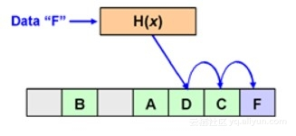
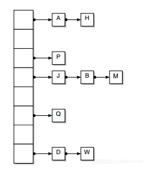

<!-- TOC -->

- [1. 说明](#1-说明)
- [2. cuckoo hash](#2-cuckoo-hash)

<!-- /TOC -->

<a id="markdown-1-说明" name="1-说明"></a>
# 1. 说明

* https://yq.aliyun.com/articles/563053


Dense Hash Table:

普通线性探查解决冲突的hash表. 对内存结构的利用不佳,插入/查询的性能会非常差.




Chain Hash Table:

拉链法解决冲突的hash表,空间利用率比较高,但是链表的空间不连续,导致查询的性能一般.




Cuckoo Hash Table:

用了两个hash函数来解决冲突.查询操作的理论复杂度为最差O(1)


<a id="markdown-2-cuckoo-hash" name="2-cuckoo-hash"></a>
# 2. cuckoo hash

* https://github.com/salviati/cuckoo (go实现)

```bash
go get github.com/salviati/cuckoo
```
