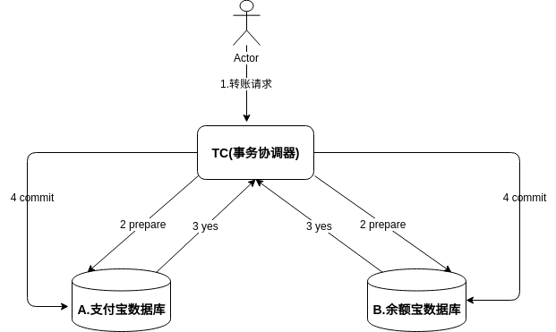

<!-- TOC -->

- [1. 资源](#1-资源)
- [2. 本质的困难](#2-本质的困难)
- [3. 分布式事务解决方案](#3-分布式事务解决方案)
    - [3.1. 2pc / 3pc](#31-2pc--3pc)
    - [3.2. 流行的协议](#32-流行的协议)
- [4. 其他: 提供回滚接口(不合理)](#4-其他-提供回滚接口不合理)
- [5. 其他: mq(非事务消息) (非百分百可靠)](#5-其他-mq非事务消息-非百分百可靠)
- [6. 其他: 本地消息表](#6-其他-本地消息表)
    - [6.1. 业务事务和消息表事务的组合](#61-业务事务和消息表事务的组合)
    - [6.2. 定时轮询(补偿)](#62-定时轮询补偿)
- [7. 其他: mq(事务消息)](#7-其他-mq事务消息)
- [8. 数据不一致梳理](#8-数据不一致梳理)

<!-- /TOC -->


<a id="markdown-1-资源" name="1-资源"></a>
# 1. 资源

* https://www.zhihu.com/question/19787937/answer/306141756 (Paxos)
* https://zhuanlan.zhihu.com/p/22820761 (互斥性与幂等性)
* https://zhuanlan.zhihu.com/p/24511879 (深入理解分布式事务)
* https://www.zhihu.com/question/35032171/answer/61706092 (微服务如何处理分布式事务)
* https://www.youtube.com/watch?v=BhosKsE8up8 (视频教程)
* http://thesecretlivesofdata.com/raft/ (raft算法)
* https://zhuanlan.zhihu.com/p/33711664 (分布式系统的一致性)
* https://en.wikipedia.org/wiki/Distributed_algorithm (分布式系统学术问题)
* https://www.roncoo.com/course/view/7ae3d7eddc4742f78b0548aa8bd9ccdb (貌似不错的教程)
* https://zhuanlan.zhihu.com/p/24511879 (深入理解分布式事务)
* https://blog.csdn.net/baidu_38116275/article/details/78688822 (非常好的博客!!!)
* https://my.oschina.net/hosee/blog/731352　(二阶段提交的问题补充)
* https://www.cnblogs.com/gudi/p/8168367.html (这个学习raft)
* https://blog.csdn.net/zmx729618/article/details/53318434 (就是我想到的思路方案)
* https://segmentfault.com/a/1190000012415698 (定时任务+幂等)
* https://blog.csdn.net/qq_16681279/article/details/78195417 (上面的图的补充)

<a id="markdown-2-本质的困难" name="2-本质的困难"></a>
# 2. 本质的困难

例如进行一次RPC调用超时,调用方无法区分
* 是网络故障还是对方机器崩溃
* 软件还是硬件错误
* 是去的路上出错还是回来的路上出错?
* 对方有没有收到,能不能重试?


<a id="markdown-3-分布式事务解决方案" name="3-分布式事务解决方案"></a>
# 3. 分布式事务解决方案

需要针对业务来选型,不控制,部分控制,完全控制

方式|方法|好处坏处
-|-|-
不控制||重要数据一致性问题导致业务出错造成损失
部分控制|本地消息表,mq,等方法|并发量和性能很好,最终一致性
完全控制|协调者+参与者 多段提交|牺牲了性能，强一致性


需求,支付宝单独数据库,余额包单独数据库,将支付宝的钱转入到余额宝,也就是:
* 支付宝数据库 -10000RMB
* 余额宝数据库 +10000RMB
如何保证事务?


<a id="markdown-31-2pc--3pc" name="31-2pc--3pc"></a>
## 3.1. 2pc / 3pc

2pc



问题:
* 同步阻塞: 参与者发出`3yes`后处于阻塞状态,要等到`4commit`后才能提交,这中间节点占用的公共资源他人无法访问
* 单点故障:  协调者发生故障,参与者会一直阻塞下去
* 数据不一致: 发送的commit可能一方收到,另一方因为网络问题没有收到
* 同时宕机问题: 协调者发出commit消息后宕机,收到commit消息的参与者也宕机了,通过选举产生了新的协调者不知道事务是否已被提交


3pc

* CanCommit
* PreCommit
* DoCommit

主要解决单点故障问题,并引入超时机制减少阻塞,`参与者无法及时收到来自协调者的信息之后,默认执行commit`.会产生不一致的问题!!!假如协调者发送的是`abort`取消事务呢!那么还是会产生数据不一致的情况!

<a id="markdown-32-流行的协议" name="32-流行的协议"></a>
## 3.2. 流行的协议

paxos

很复杂,不好理解 ===待分析

raft
* Etcd
* consul

考虑到事务协调器和参与者会挂掉的情况,引入了Leader,Follower,Candidate达到了最终一致性.

zab
* zookeeper

<a id="markdown-4-其他-提供回滚接口不合理" name="4-其他-提供回滚接口不合理"></a>
# 4. 其他: 提供回滚接口(不合理)

> 功能x,需要去协调后端的A,B甚至更多的原子服务.那假如A和B其中一个调用失败了怎么办?

Backends For Frontends(服务于前端的后端)

> 每天登录奖励用户5个积分的业务场景,积分和登录是两套服务


!!!这个方案不合理,登录失败时宕机就不能保持数据的一致性了


<a id="markdown-5-其他-mq非事务消息-非百分百可靠" name="5-其他-mq非事务消息-非百分百可靠"></a>
# 5. 其他: mq(非事务消息) (非百分百可靠)

```
tc.begin()
   result,err := update table 
   if err != nil {
       rollback() // 操作数据库失败,不向mq投递消息
   } else {
       err := mq.push() && mq.getAck() // (设置超时时间)

       if err != nil {
           commit()  // 操作数据库成功,向mq投递消息成功(同步得到ack)
       } else {
           rollback() // 操作数据库成功,向mq投递消息失败
       }
   }
tc.end()
```

失败情况:
1. 上游数据库操作本身失败
2. 投递mq时发生问题(`去mq路上网络故障,mq没收到`)

结果(明确): `上游业务rollback`和`mq得不到事务消息即下游不执行事务`,上下游一致性保证

极端时最痛苦的情况:  
操作数据库成功,向mq投递消息时
1. mq push 堆积在发送缓冲区,对方过一会才收到push,超时,未完成commit
2. mq ack发了,但是上游在收ack时网络故障,超时,未完成commit
3. mq ack发了,但是上游在收到ack后宕机,未完成commit

这时候就会造成`下游事务commit`了,`上游事务得不到commit`,上下游的一致性得不到保证,重要业务出错时会造成财产损失


<a id="markdown-6-其他-本地消息表" name="6-其他-本地消息表"></a>
# 6. 其他: 本地消息表

> 基本的设计思想是将远程分布式事务拆分成一系列的本地事务

> 说白了就是,`记录+补偿`,用事务组合把`通知这件事`记录在库里. 通知成功就`删除这件事`,通知`失败或不确定`就依靠定时任务补偿性的通知

我这里搭配mq使用
* 把`mq(非事务消息)`的mq.push()修改成加入到消息表 (一个事务)
* 然后通过轮询的方式把消息扔到mq,mq持久化再扔到下游


<a id="markdown-61-业务事务和消息表事务的组合" name="61-业务事务和消息表事务的组合"></a>
## 6.1. 业务事务和消息表事务的组合
```
tc.begin()
err := db.updateBusiness && db.updateLocalMsgOut
if err != nil {
    rollback()
} else {
    commit()
}
tc.end()

tc.begin()
    db.getLocalMsgOut(msgId)  && db.deleteMsgOut(msgId)
    err := mq.push() && mq.getAck() // (设置超时时间)
    if err != nil {
        commit()   // 操作数据库成功,向mq投递消息成功(同步得到ack)
    } else {
        rollback() // 操作数据库成功,向mq投递消息失败
    }
tc.end()
```

失败情况:
* 投递mq时发生问题(去mq路上网络故障,mq没收到)

结果(明确): 上游业务事务已经commit了,下游还没有commit.写个警报即可. 接下来会有轮询线程

极端情况:  
参考下面的定时轮询

<a id="markdown-62-定时轮询补偿" name="62-定时轮询补偿"></a>
## 6.2. 定时轮询(补偿)

```
for (ticker) {
    tc.begin()
    
    err := db.getAndDelMsg()
    if err != nil {
        rollback() // 操作数据库失败,不向mq投递消息
    }

    err := mq.push() && mq.getAck() // (设置超时时间)

    if err != nil {
        commit()   // 操作数据库成功,向mq投递消息成功(同步得到ack)
    } else {
        rollback() // 操作数据库成功,向mq投递消息失败
    }
    
    tc.end()
}
```

失败情况:
* 上游数据库操作本身失败 (`不可能发生吧`)
* 投递mq时发生问题(`去mq路上网络故障,mq没收到`)

结果(明确): `上游业务事务已经commit了`,`下游还没有commit`.写个警报即可,没啥问题,因为他是轮询,还是一个最终一致性.

极端情况:
操作数据库成功,向mq投递消息后
1. mq push 堆积在发送缓冲区,对方过一会才收到push,超时,未完成commit
2. mq ack发了,但是上游在收ack时网络故障,未完成commit
3. mq ack发了,但是上游在收到ack后宕机,未完成commit

没关系,此时两边的业务事务已经commit了. 上游会再次轮询消息表再次发送. `注意!!!: 下游服务一定要是幂等的,不然业务会出问题`


<a id="markdown-7-其他-mq事务消息" name="7-其他-mq事务消息"></a>
# 7. 其他: mq(事务消息)

各大`知名的电商平台`和`互联网公司`,几乎都是采用`类似的设计思路`来实现最终一致性的.

和上面的 `本地消息表(可靠) ` 本质上是一样的 记录+补偿, 本地消息表是把记录通过事务来本地记录,而mq(事务消息)是把记录的任务放到mq,`需要mq支持`


rocketmq的事务消息:  
https://help.aliyun.com/document_detail/43348.html

业务场景:
BOB -> Smith 转账

也即是
1. BOB 扣100
2. Smith 加100


1. 阶段1 发送prepared
2. 阶段2 执行本地事务
3. 阶段3 拿到消息地址去访问消息,并修改状态

额外: mq会定期扫描消息集群中的状态,向消息发送者确认消息是否需要发送(远端commit)


如下是rocketmq的事务消息


<a id="markdown-8-数据不一致梳理" name="8-数据不一致梳理"></a>
# 8. 数据不一致梳理

参考: https://zhuanlan.zhihu.com/p/25346771

* rpc完全依赖下游,下游不能挂  (本地产生状态的不适用!!!!!)
* 非强依赖可降级(同步转异步) (rpc转消息队列)
* 完全异步化,下游服务只消费我写入的队列,不与之rpc通信 (纯消息队列)


如果有多个服务的依赖,如何确保一致性? rpc接口幂等 + 责任第三方


