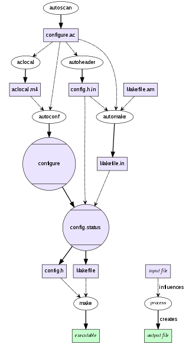

v
<!-- TOC -->

- [1. 资料](#1-资料)
- [2. 怎么搜索](#2-怎么搜索)
- [3. autotools](#3-autotools)

<!-- /TOC -->

# 1. 资料

* https://cmake.org/Wiki/CMake_Useful_Variables (变量)
* http://nuclear.mutantstargoat.com/articles/make/ (make file)
* https://www.zhihu.com/question/37316844 (为什么c++的构建系统和依赖管理这么混乱)
* https://segmentfault.com/a/1190000000349917 (makefile头文件增量编译)
* https://zhuanlan.zhihu.com/p/29910215 (MakeFile 发展历史)
* https://blog.csdn.net/dongtingzhizi/article/details/9146721 (笔记一 - 不要看了)
* https://blog.csdn.net/dongtingzhizi/article/details/9163917 (笔记二 - 不要看了)
* https://www.zhihu.com/question/23792247/answer/600773044
* https://www.gnu.org/software/automake/manual/automake.pdf (这个pdf可以)





# 2. 怎么搜索

clang site:https://cmake.org/cmake/help


# 3. autotools

```bash
CC
CFLAGS

CXX
CXXFLAGS

LDFLAGS
CPPFLAGS

xxx_SOURCES
xxx_LDFLAGS
xxx_LDADD

```
