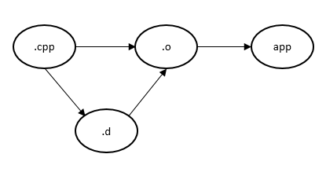
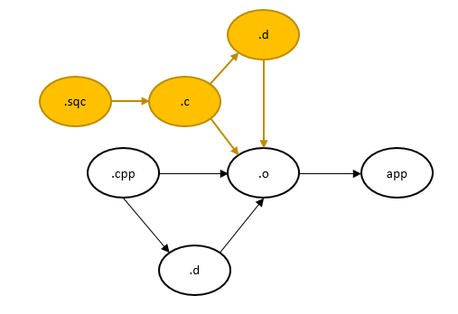

<!-- TOC -->

- [1. makefile 常用变量记录](#1-makefile-常用变量记录)
- [2. d文件](#2-d文件)
- [3. 依赖关系](#3-依赖关系)
- [4. sqc 文件](#4-sqc-文件)
- [问题是预编译的include不能推算出头文件](#问题是预编译的include不能推算出头文件)

<!-- /TOC -->


<a id="markdown-1-makefile-常用变量记录" name="1-makefile-常用变量记录"></a>
# 1. makefile 常用变量记录

变量|含义
-|-
CC	|Program for compiling C programs; default ‘cc’.	C语言编译器,默认gcc
CXX	|Program for compiling C++ programs; default ‘g++’.	C++语言编译器,默认g++
CPP	|Program for running the C preprocessor, with results to standard output; default ‘$(CC) -E’.	
RM	|Command to remove a file; default ‘rm -f’.	
CFLAGS	|Extra flags to give to the C compiler.	C语言编译器编译选项
CXXFLAGS	|Extra flags to give to the C++ compiler.	C语言编译器编译选项
CPPFLAGS	|Extra flags to give to the C preprocessor and programs that use it (the C and Fortran compilers).	
LDFLAGS	|Extra flags to give to compilers when they are supposed to invoke the linker, ‘ld’, such as -L. Libraries (-lfoo) should be added to the LDLIBS variable instead.	链接选项

* $@ 目标文件名 
* $< 第一个依赖文件名 
* $^ 所有依赖文件列表 
* @ 不输出make的信息 


<a id="markdown-2-d文件" name="2-d文件"></a>
# 2. d文件

```
bdefine.o: bdefine.cpp ../buinc/stdafx.h ../buinc/bdefine.h \
 ../buinc/cxpack.h ../buinc/PackB.h ../buinc/PackC.h ../buinc/bupub.h \
 ../buinc/comstru.h ../buinc/svrlink.h ../buinc/tcp.h ../buinc/MsgQueue.h \
 ../buinc/BUShm.h ../buinc/BUSem.h ../buinc/logfile.h ../buinc/logfile.h \
 ../buinc/mypub.h ../buinc/svrlink.h ../buinc/cxpack.h \
 ../buinc/MsgQueue.h
```

<a id="markdown-3-依赖关系" name="3-依赖关系"></a>
# 3. 依赖关系



* (1) .o依赖.cpp
* (2) .o依赖.d
* (3) .d依赖.cpp
* (4) app依赖.o

发生变化时
* 当源文件产生变化时的增量编译 (1) .o依赖.cpp
* 当头文件产生变化时的增量编译 (2) .o依赖.d
* 当源文件include新的头文件的增量编译 (2) .o依赖.d (3) .d依赖.cpp


得到所有文件名
```
src = BUSem.cpp BUShm.cpp MemQueue.cpp \
MsgQueue.cpp bupub.cpp bdefine.cpp \
logfile.cpp mypub.cpp profile.cpp \
slist.cpp stdafx.cpp svrlink.cpp tcp.cpp
obj = $(src:.cpp=.o)
dep = $(obj:.o=.d)
```

(1) .o依赖.cpp
```
%.o: %.cpp
	$(CXX) $(CXXFLAGS) -c $< -o $@ 
```

(2) .o依赖.d
```
	-include $(dep)
```

(3) .d依赖.cpp
```
%.d: %.cpp
	@$(CPP) $(CXXFLAGS) $< -MM -MT $(@:.d=.o) >$@
```

(4) app依赖.o
```
libbupub.so: $(obj)
	$(CXX) $^ -shared -m32 -o $@ 
```

最终的版本

```
CXX = g++
CXXFLAGS = -I../buinc -DLINUX -DBUPUBLIB -Wall -m32

src = BUSem.cpp BUShm.cpp MemQueue.cpp \
MsgQueue.cpp bupub.cpp bdefine.cpp \
logfile.cpp mypub.cpp profile.cpp \
slist.cpp stdafx.cpp svrlink.cpp tcp.cpp
obj = $(src:.cpp=.o)
dep = $(obj:.o=.d)

ALL: libbupub.so libbupubs.a

libbupub.so: $(obj)
	$(CXX) $^ -shared -m32 -o ../lib/$@ 

libbupubs.a: $(obj)
	ar -rv ../lib/$@ $^

-include $(dep)

%.o: %.cpp
	$(CXX) $(CXXFLAGS) -c $< -o $@ 

%.d: %.cpp
	@$(CPP) $(CXXFLAGS) $< -MM -MT $(@:.d=.o) >$@

.PHONY: clean
clean:
	rm -f $(obj)

.PHONY: cleandep
cleandep:
	rm -f $(dep)
```


<a id="markdown-4-sqc-文件" name="4-sqc-文件"></a>
# 4. sqc 文件


如图黄色内容,增加
```
%.c: %.sqc
	cpre64 $(INCLDIR) $(sqcs)

%.o: %.c
	$(CC) $(CFLAGS) -c $< -o $@ 

%.d: %.c
	@$(CC) $(CFLAGS) $< -MM -MT $(@:.d=.o) >$@
```

全量makefile
```
SYBASEINC = /opt/sybase-15/OCS-15_0/include
SYBASELIB = /opt/sybase-15/OCS-15_0/lib
APPPATH = /opt/sybase-15/fixii
USERLIB = /usr/lib
USERINC = /usr/include

CC = gcc
CXX = g++
INCLDIR = -I../buinc -I$(SYBASEINC) -I$(USERINC)
LIBPATH = -L$(SYBASELIB) -L../lib -L$(USERLIB)
CFLAGS = -Wall -g -m32 $(INCLDIR) $(LIBPATH)
CXXFLAGS = -Wall -g -m32 $(INCLDIR) $(LIBPATH)

sqcs = fixsybasedi.sqc fixpubs.sqc
cs = $(sqcs:.sqc=.c)
cpps = ksfixbu.cpp FIXData.cpp fixbase.cpp BDFTest.cpp string_extra.cpp common.cpp

src = $(cs) $(cpps)
obj = $(cs:.c=.o) $(cpps:.cpp=.o)
dep = $(obj:.o=.d)

ALL: libfixbus.a libfixbu.so 

libfixbus.a: $(obj)
	ar -rv ../lib/libfixbus.a $(obj)

libfixbu.so: $(obj)
	$(CXX) -shared $(obj) -m32 -o ../lib/$@

-include $(dep)

%.o: %.cpp
	$(CXX) $(CXXFLAGS) -c $< -o $@ 

%.d: %.cpp
	@$(CPP) $(CXXFLAGS) $< -MM -MT $(@:.d=.o) >$@


.SUFFIXES: .sqc

%.c: %.sqc
	cpre64 $(INCLDIR) $(sqcs)

%.o: %.c
	$(CC) $(CFLAGS) -c $< -o $@ 

%.d: %.c
	@$(CC) $(CFLAGS) $< -MM -MT $(@:.d=.o) >$@

.PHONY: clean
clean:
	rm -f $(obj)

.PHONY: cleandep
cleandep:
	rm -f $(dep)
```

<a id="markdown-问题是预编译的include不能推算出头文件" name="问题是预编译的include不能推算出头文件"></a>
# 问题是预编译的include不能推算出头文件

这样的include生成不了依赖关系
```
EXEC SQL BEGIN DECLARE SECTION;
EXEC SQL INCLUDE "fixpackdefine.h";
char sClOrdID[21];
EXEC SQL END DECLARE SECTION;
```

解决方法是重新生成.c文件