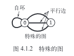
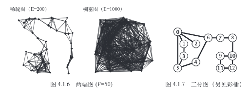

<!-- TOC -->

- [1. 资料](#1-资料)
- [2. hash](#2-hash)
- [3. 图](#3-图)
    - [3.1. 无向图](#31-无向图)
    - [3.2. 有向图](#32-有向图)
    - [3.3. 最小生成树](#33-最小生成树)
    - [3.4. 最短路径](#34-最短路径)

<!-- /TOC -->

<a id="markdown-1-资料" name="1-资料"></a>
# 1. 资料

* https://en.wikipedia.org/wiki/List_of_data_structures
* https://www.cs.usfca.edu/~galles/visualization/Algorithms.html (算法可视化)
* https://visualgo.net/ (算法可视化)
* http://bigocheatsheet.com/ (算法复杂度)
* https://en.wikipedia.org/wiki/Algorithmic_efficiency (算法复杂度)
* https://www.zhihu.com/question/20370438 (提高算法能力的书籍)
* https://www.zhihu.com/question/20368410 (学习算法网站推荐)
* https://www.zhihu.com/question/40000881/answer/379225794 (程序员应该掌握哪些?)
* https://zhuanlan.zhihu.com/p/26899736 (在B站学数学)
* http://chengyichao.info/visual-graph-traversal/ (图可视化)
* https://github.com/yqsy/Data-Structure (我fork的一份整理)

<a id="markdown-2-hash" name="2-hash"></a>
# 2. hash

* https://www.zhihu.com/question/20820286 (什么是hash)
* http://www.azillionmonkeys.com/qed/hash.html
* https://en.wikipedia.org/wiki/List_of_hash_functions#Non-cryptographic_hash_functions (hash 算法列表)

<a id="markdown-3-图" name="3-图"></a>
# 3. 图

图的典型应用


应用|节点|连接
-|-|-
地图|十字路口|公路
网络内容|网页|超链接
电路|元器件|导线
任务调度|人物|限制田间
商业交易|客户|交易
配对|学生|申请
计算机网络|网站|物理连接
软件|方法|调用关系
社交网络|人|友谊关系

算法4中,列出最重要的4种图模型:
* 无向图(简单连接)
* 有向图(连接有方向)
* 加权图(连接带有权值)
* 加权有向图(连接既有方向又带有权值)

> 定义: 图是由一组顶点和一组能够将两个顶点相连的边组成的.

<a id="markdown-31-无向图" name="31-无向图"></a>
## 3.1. 无向图

两种简单而特殊的情况:
* 自环: 一条连接一个顶点和其自身的边
* 连接同一对顶点的两条边称为平行边

> 数学家将含有平行边的图称为`多重图`,将没有平行边或自环的图称为`简单图`,我们不会将它们作为示例,因此,我们用两个顶点就可以指代一条边了

术语:

* 相邻: 两个顶点通过一条`边相连`时,我们称这`两个顶点是相邻`的
* 度数: 某个`顶点`的度数及依附于它的边的总数
* 路径: 边顺序连接的一系列顶点
* 简单路径: 没有重复顶点的路径
* 环: 至少包含一条边且起点和终点相同的路径
* 简单环: (除了起点和终点必须相同之外)不含有重复顶点和边的环
* 环的长度(路径): 其中所包含的边数
* 连通: 两个顶点之间存在一条连接双方的路径,我们称为一个顶点和另一个顶点是连通的
* 连通图: 从任意一个顶点都存在一条路径到达另一个任意顶点
* 无环图: 不包含环的图
* 无环连通图: 树是一棵无环连通图,互不相连的树组成的集合称为森林.`连通图的生成树是它的一副子图`,它含有图中所有的顶点且是一棵树.图的`生成树森林`是它的所有连通子图的生成树的集合
* 稀疏图: 被连接的顶点对很少
* 稠密图: 只有少部分顶点对之间没有边连接
* 二分图: 能够将所有节点分为两部分的图




---
* 一般情况下,我们研究的都是`简单环`和`简单路径`并会`省略掉简单`二字
* 允许重复顶点时,我们指的是一般的路径和环
* u-v-w-x 表示u到x的一条路径, u-v-w-x-u 表示一个环

一副含有V个结点的图G满足下列5个条件之一时,它就是一颗树:
* G有V-1条边且不含有环
* G有V-1条边且是连通的
* G是连通的,但删除任意一条边都会使它不再连通
* G是无环图,但添加任意一条边都会产生一条环
* G中的任意一对顶点之间仅存在一条简单路径

图的表示方法包含以下两个要求:
* 它必须为可能在应用中碰到的各种类型的图预留出足够的`空间`
* 实例的实现方法一定要`快`

图的三种表示方法:
* 邻接矩阵: V*V的布尔矩阵,当顶点v和顶点w之间有相连接的边时,定义v行w列的元素值为true,否则为flase. 但是这种方法不符合第一个条件--V2个布尔值所需的空间是不能被满足的.
* 边的数组: 使用Edge类,含有两个int实例变量,不满足实现adj()需要检查图中的所有边
* `邻接表数组`: 一个以顶点为索引的列表数组


典型Graph实现的性能复杂度

数据结构|所需空间|添加一条边v-w|检查w和v是否相邻|遍历v的所有相邻顶点
-|-|-|-|-
边的列表|E|1|E|E
邻接矩阵|V^2|1|1|V
邻接表(允许存在平行边)|E+V|1|degree(V)|degree(V)
邻接集(不允许存在平行边)|E+V|logV|logV|logV+degree(V)

关于自环和平行边的思考:

* 自环要求near`数组/集合中的数字`不能等于`顶点的数字`,要在加入时做判断
* 不允许平行边要求near为集合(元素不重复),而非数组

```java
private Bag<Integer>[] adj;  // 支持平行边

private Set<integer>[] adj2; // 不支持平行边

```

```go
adj [][]int // 支持平行边
```

<a id="markdown-32-有向图" name="32-有向图"></a>
## 3.2. 有向图

应用|顶点|边
-|-|-
事物链|物种|捕食关系
互联网连接|网页|超链接
程序|模块|外部引用
手机|电话|呼叫
学术研究|论文|引用
金融|股票|交易
网络|计算机|网络连接

> 一副有方向性的图是由`一组顶点和一组有方向的边组成的`,每条有方向的边都连接着有序的一对顶点

多点可达性的一个重要的实际应用是在典型的内存管理系统中.许多java的实现,一副有向图中,`一个顶点表示一个对象`,`一条边则表示一个对象对另一个对象的引用`.标记-清楚的垃圾回首策略会为`每个对象保留一个位`做垃圾收集之用,周期性的运行一个类似于DirectedDFS的有向图可达性算法来`标记`所有可以被访问到的对象,然后`清理`所有对象.

* 拓扑排序: 给定一副有向图,将所有的顶点排序,使得所有的有向边均从排在前面的元素指向排在后面的元素. `仅当一副图是有向无环图时它才能进行拓扑排序.`
* 有向无环图: DAG 就是一副不含有向环的有向图
* 一副有向无环图的拓扑顺序即为所有顶点的`逆后序排列`.
* 传递闭包: 由相同的一组顶点组成的另一幅有向图,在传递闭包中存在`一条从v指向w的边`当切仅当在G中w是从v可达的
* 每个顶点对于自己都是可达的

应用:  

应用|顶点|边
-|-|-
任务调度|任务|优先级限制
课程安排|课程|先导课程限制
继承|Java类|extends关系
电子表格|单元格|公式
符号链接|文件名|链接

> 如果`两个顶点v和w是互相可达`的,则称`他们为强连通`的,如果一副有向图中的`任意两个顶点都是强连通的`,则称这副有向图也是强连通的.

强连通分量,有向图中的强连通性也是一种顶点之间等价关系,有以下性质
* 自反性: 任意顶点v和自己都是强连通的
* 对称性: 如果v和w是强连通的,那么w和x也是强连通的
* 传递性: 如果v和w是强连通的且w和x也是强连通的,那么v和x也是强连通的

强连通图:

应用|顶点|边
-|-|-
网络|网页|超链接
教科书|话题|引用
软件|模块|调用
食物链|物种|捕食关系

<a id="markdown-33-最小生成树" name="33-最小生成树"></a>
## 3.3. 最小生成树

> 定义: 给定一幅加权无向图,找到它的一颗最小生成树

> 图的生成树是它的一棵含有其`所有顶点的无环连通子图`,一幅加权图的最小生成树(MST)是它的一棵权值(树中所有边的权值之和)

应用

应用领域|顶点|边
-|-|-
电路|元器件|导线
航空|机场|航线
电力分配|电站|输电线
图像分析|面部容貌|相似关系

Prim算法,每一步都会为一棵生长中的树添加一条边.每次总是将下`一条连接树中的顶点`与`不在树中的顶点`且`权重最小`的边加入树中

* 顶点: 顶点索引的bool数组marked[],如果顶点v在书中,marked[v]的值为true
* 边: 两种数据结构 1. 一条队列mst来保存最小生成树的边 2. 一个顶点索引的Edge对象的数组edgeTo[],其中edgeTo[v]将v连接到树中的Edge对象
* 横切边: 使用一条优先队列MinPQ<Edge>来根据权重比较所有边

Kruskal算法构造最小生成树的时候也是一条一条边的构造,但不同的是它寻找的边会连接一片森林中的两棵树

* 优先队列: 将边按照权重排序
* union-find数据结构: 识别会形成环的边
* 队列: 保存最小生成树的所有边

<a id="markdown-34-最短路径" name="34-最短路径"></a>
## 3.4. 最短路径

> 找到从一个顶点到达另一个顶点的成本的最小的路径

