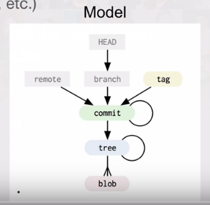
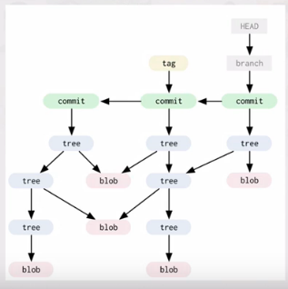
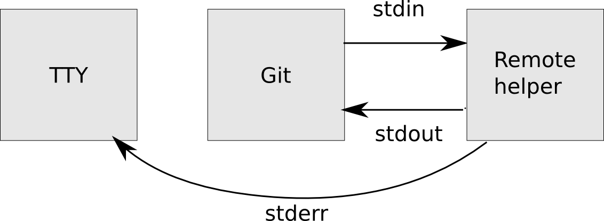

<!-- TOC -->

- [1. 资料](#1-资料)
- [2. 删除本地以及remote的分支](#2-删除本地以及remote的分支)
- [3. push 所有分支](#3-push-所有分支)
- [4. 文本文件行尾LF](#4-文本文件行尾lf)
- [5. 切换到最新的master](#5-切换到最新的master)
- [6. clone windows目录](#6-clone-windows目录)
- [7. 设置用户名和邮箱](#7-设置用户名和邮箱)
- [8. 清理文件夹](#8-清理文件夹)
- [9. windows lf](#9-windows-lf)
- [10. 其他](#10-其他)
- [11. 底层](#11-底层)
- [12. 继续整理](#12-继续整理)
    - [12.1. 一个blob对象的实验](#121-一个blob对象的实验)
    - [12.2. tree对象](#122-tree对象)
    - [12.3. 继续实验](#123-继续实验)
    - [12.4. references](#124-references)
    - [12.5. packfiles](#125-packfiles)
    - [12.6. refspec(远程映射？)](#126-refspec远程映射)
    - [12.7. 协议](#127-协议)
    - [12.8. http流程](#128-http流程)
    - [12.9. 上传数据(智能)](#129-上传数据智能)
    - [12.10. 下载数据(智能)](#1210-下载数据智能)
- [13. gitremotehelp](#13-gitremotehelp)

<!-- /TOC -->

<a id="markdown-1-资料" name="1-资料"></a>
# 1. 资料

* https://git-scm.com/book/zh/v2 (git book)
* http://backlogtool.com/git-guide/cn/intro/intro1_1.html (猴子都能看的懂)
* https://www.quora.com/What-version-control-systems-do-large-companies-use (大公司用什么版本管理工具)
* https://github.com/xirong/my-git (学习资料)
* http://www.cnblogs.com/ShaYeBlog/p/5712839.html (托管商)

<a id="markdown-2-删除本地以及remote的分支" name="2-删除本地以及remote的分支"></a>
# 2. 删除本地以及remote的分支
* https://stackoverflow.com/questions/2003505/how-do-i-delete-a-git-branch-both-locally-and-remotely

```bash
# -D表示强制删除
git branch -D branch1
git push origin --delete branch1
```

<a id="markdown-3-push-所有分支" name="3-push-所有分支"></a>
# 3. push 所有分支
```
git push --all origin
```

<a id="markdown-4-文本文件行尾lf" name="4-文本文件行尾lf"></a>
# 4. 文本文件行尾LF
.gitattributes
```
*.sqc text eol=lf
```

<a id="markdown-5-切换到最新的master" name="5-切换到最新的master"></a>
# 5. 切换到最新的master
```
git fetch && git reset --hard origin/master
```

<a id="markdown-6-clone-windows目录" name="6-clone-windows目录"></a>
# 6. clone windows目录
```bash
git clone file:////10.243.141.8/git/cache
```

<a id="markdown-7-设置用户名和邮箱" name="7-设置用户名和邮箱"></a>
# 7. 设置用户名和邮箱
```
git config --global user.email "yqsy021@126.com"
git config --global user.name "yqsy"
```

<a id="markdown-8-清理文件夹" name="8-清理文件夹"></a>
# 8. 清理文件夹

```bash
# 回退修改但没有commit的内容
git reset --hard

# 清理忽视/未被忽视/文件夹
git clean -fxd

# 清理未被忽视/文件夹
git clean -fd

# 删除已经提交但是ignore的文件 (漏掉了.cache?)
git ls-files -ci --exclude-standard

git ls-files -ci --exclude-standard -z | xargs -0 git rm --cached
```
<a id="markdown-9-windows-lf" name="9-windows-lf"></a>
# 9. windows lf

```bash
git config --global core.autocrlf false
```

说明|指令
-|-
忽视	|-fX
未被忽视	|-f
忽视+未被忽视	|-fx
文件夹	|-d

<a id="markdown-10-其他" name="10-其他"></a>
# 10. 其他

```bash
# 设置默认远程仓库为privatekeychain,分支为pkc
git push -u privatekeychain pkc

```

<a id="markdown-11-底层" name="11-底层"></a>
# 11. 底层

* https://www.cnblogs.com/gscienty/p/7904518.html (csdn的)

```bash
# 文件 
COMMIT_EDITMSG  # 最近一次的commit message,git系统都不会用到,给用户一个参考
config          # git 仓库的配置文件
description     # 主要给gitweb等git托管文件使用
HEAD            # 存在挡墙所在分支的指针文件路径,一般指向refs的某文件
index           # 暂存区,一个二进制文件

# 路径
branches
hooks            # 存放脚本
info             # 存放仓库信息???
ipfs             
ipld
logs             # 存储日志的文件夹
objects          # !!!所有git对象
refs             # !!!存储各个分支的指针

```

git系统中的三个实体
* 提交节点实体  核心实体,`节点`与`节点`之间的`继承关系`
* 节点内容实体  本次提交的`文件名`和所`对应`的`hash`
* 文件内容实体 用于`具体记录文件的内容`,所有的历史都有备份

存储时采用`deflate`对原始文件内容进行压缩, key 根据`原始文件内容`,`文件大小`等数据生成的消息摘要

在当前版本的git中,主要采用SHA1算法,将`文件格式`与`文件长度`组成`头部`,将`文件内容`作为`尾部`,由头部和尾部拼接作为原文,经过SHA1算法计算之后得到该文件的160位长的SHA1签名.一般用`长度为40`的字符串来表示,将字符串的前两个字符作为文件夹,后38个字符作为文件名进行存储

计算差异使用`pack`算法: https://github.com/git/git/blob/master/Documentation/technical/pack-heuristics.txt

merkle dag


实验

```
mkdir testipfs
cd testipfs
git init

# 一次提交两个文件
echo "this is readme" > readme.md
echo "hello" > 1.txt
git add .  && git commit -a -m "1"

# 已有两个文件再提交第三个文件
echo "world" > 2.txt
git add .  && git commit -a -m "2"

# 三个文件都存在,修改其中一个文件(增)
echo ", thar is readme too" >> readme.md
git commit -a -m "3"

# 修改增加很多字呢(不可能是全量的吧)
echo "123123123123123123123213213" >> readme.md
git commit -a -m "4"

```

```bash
# 查看hash值的方法
git cat-file -p SHA1
```


<a id="markdown-12-继续整理" name="12-继续整理"></a>
# 12. 继续整理

* https://www.youtube.com/watch?v=P6jD966jzlk
* https://github.com/pluralsight/git-internals-pdf
* https://github.com/ChainBook/IPFS-For-Chinese/blob/master/IPFS%E7%90%86%E8%AE%BA%E5%9F%BA%E7%A1%80/Git%E5%8E%9F%E7%90%86.md




对象类型
* Commit - Author,message,pointer to a tree of changes
* Tree - Pointer to file names, content , other trees
* Blob - Data (source code,pictures,video, etc.)


知识点:
* git是一个 Directed acyclic graph (有向无环图)
* commits都会引用父亲节点
* 分支是commit的引用
* master是权威的主线分支
* HEAD 是特殊的指针,指向最新的提交

和文件的映射

指向|文件名|内容|含义
-|-|-|-
HEAD|HEAD|ref: refs/heads/master|最近一次提交的branch
branch|refs/heads/`<branch>`|hash|branch相应的commit hash
remote|refs/remotes/`<remoteName>`/`<branch>`|hash|branch相应的commit hash
tag|refs/tags/`<version>`|hash|tag相应的tag hash
tree|objects/`<hash>`|object|对象,包括commit,tree,blob和tag
blob|objects/`<hash>`|object|同上




```bash
# 观察文件夹变化
watch -n 1 -d find .


```

* 已提交 committed  被安全的保存在本地数据库中
* 已修改 modified 修改了某个文件，但还没有提交保存
* 已暂存 staged 把已修改的文件存放在下次提交时要保存的清单中

对于文件所处的位置来判断状态
* git目录中保存着的特定版本文件，就属于已提交状态
* 作了修改并已放入暂存区域，就属于已暂存状态
* 自上次取出后,作了修改但还没有放到暂存区域,就是已修改状态

<a id="markdown-121-一个blob对象的实验" name="121-一个blob对象的实验"></a>
## 12.1. 一个blob对象的实验
```bash
mkdir test
git init
find .git/objects
find .git/objects -type f

# 初始化内容
echo 'test content' | git hash-object -w --stdin
find .git/objects -type f
git cat-file -p $hash

# 内容1
echo 'version 1' > test.txt
git hash-object -w test.txt

# 内容2
echo 'version 2' > test.txt
git hash-object -w test.txt

# 3个objects
find .git/objects -type f
```

<a id="markdown-122-tree对象" name="122-tree对象"></a>
## 12.2. tree对象

在tree中,所有内容以tree或blob对象存储,类似于递归向下

```bash
# 分支上最新提交指向的tree对象
git cat-file -p master^{tree}
```

文件模式:
* 100644 普通文件
* 100755 可执行文件
* 120000 符号链接


<a id="markdown-123-继续实验" name="123-继续实验"></a>
## 12.3. 继续实验
```bash
# 把文件写到暂存区
git update-index --add --cacheinfo 100644 d670460b4b4aece5915caf5c68d12f560a9fe3e4 test1.txt

# 把暂存区的内容写到一个tree对象
git write-tree

# 新创建一个文件,直接生成blob加入到tree
echo 'new file' > new.txt

git update-index --add new.txt

# 生成一个新的对象
git write-tree


# 将第一次生成的tree作为一个目录再扔到当前目录下生成一个新的tree
git read-tree  --prefix=bak eef15dc2733be81aedb7bbdf39127b34e38b9f4e
git write-tree

# commit (但是我不知道为什么这一步没有真正的提交,所以我使用了git commit就后继)
echo 'first commit' | git commit-tree 52210aa7448b8f6ead6141789d3cace4581cd126

```

<a id="markdown-124-references" name="124-references"></a>
## 12.4. references

```bash
find .git/refs


# 最近一次提交的branch
cat .git/HEAD

# branch相应的commit哈希
cat .git/refs/heads/master


# 显示hash
git log --pretty=oneline  master


# tags
ls .git/refs/tags

# remotes
ls .git/refs/remotes
```

<a id="markdown-125-packfiles" name="125-packfiles"></a>
## 12.5. packfiles


```bash
curl https://raw.githubusercontent.com/mojombo/grit/master/lib/grit/repo.rb > repo.rb
git add repo.rb
git commit -m 'added repo.rb'

# 查看文件hash值
git cat-file -p master^{tree}

du -b .git/objects/03/3b4468fa6b2a9547a70d88d1bbe8bf3f9ed0d5

# 添加一行
echo '# testing' >> repo.rb

git commit -am 'modified repo a bit'

# 多了一个完整的copy

# gc
git gc


# 查看　文件详细
git verify-pack -v .git/objects/pack/pack-23ebb38eb638d4a10ae17fb547074d2db9845a83.idx
```

git 往磁盘保存对象时默认使用的格式叫松散对象(loose object)格式,git`时不时`地将这些对象打包至一个叫`packfile`的二进制文件以节省空间并提高效率,当仓库中有太多的松散对象,或是手工调用`git gc`命令,或推送至远程服务器,git都会这样做. (还有`差分压缩`，差异保存)


<a id="markdown-126-refspec远程映射" name="126-refspec远程映射"></a>
## 12.6. refspec(远程映射？)

```bash
git remote add origin https://github.com/yqsy/test.git

cat .git/config
```

```
[remote "origin"]
	url = https://github.com/yqsy/test.git
	fetch = +refs/heads/*:refs/remotes/origin/*
```

格式是 +<src>:<dst>

* <src> 是远端上的引用格式
* <dst> 将要记录的本地的引用格式

缺省情况下refspec会被git remote add 命令自动生成,git会获取`远端上refs/heads/`下面的所有引用,并将它写入到本地的`refs/remotes/origin`,

查看远程的历史
```bash
git log origin/master
git log remotes/origin/master
git log refs/remotes/origin/master

# 上面的都是等价的,因为git会把她们扩展成refs/remotes/origin/master
```

```bash
# fetch 分支 (可以同时fetch多个分支)
git fetch origin master:refs/remotes/origin/master

# 你也可以在配置文件中指定多个refspec,如果想在每次获取时都获取master和experiment分支.就添加两行
[remote "origin"]
       url = git@github.com:schacon/simplegit-progit.git
       fetch = +refs/heads/master:refs/remotes/origin/master
       fetch = +refs/heads/experiment:refs/remotes/origin/experiment
```


```
# 如果第一次选择push
git push --set-upstream origin master


# config就会增加master
yq@yq-PC:/media/yq/ST1000DM003/linux/reference/test/testgit/.git% cat config
[core]
	repositoryformatversion = 0
	filemode = false
	bare = false
	logallrefupdates = true
[remote "origin"]
	url = file:///media/yq/ST1000DM003/linux/reference/test/testgit-remote
	fetch = +refs/heads/*:refs/remotes/origin/*
[branch "master"]
	remote = origin
	merge = refs/heads/master
```

<a id="markdown-127-协议" name="127-协议"></a>
## 12.7. 协议

* https://
* file://
* ssh://
* git://


<a id="markdown-128-http流程" name="128-http流程"></a>
## 12.8. http流程 
```
git clone http://github.com/schacon/simplegit-progit.git
```

`.git/info/refs`(起点提交)  <- 服务端`update-server-info`

`.git/HEAD` (应该被检出的目录)

`.git/objects/xx/hash` (获取commit) -> 递归commit

`.git/objects/xx/hash` (获取tree) -> 递归tree

如果tree对象在服务端不以松散对象存在,会得到404响应 -> `.git/objects/info/packs`

`.git/objects/pack/pack-hash.idx`


<a id="markdown-129-上传数据智能" name="129-上传数据智能"></a>
## 12.9. 上传数据(智能)
至远端,git使用 `send-pack` 和 `receive-pack` . 这个`send-pack`进程运行在客户端上,连接至远端运行的`receive-pack`进程


```bash
# ssh 大概会执行
ssh -x git@github.com "git-receive-pack 'schacon/simplegit-progit.git'"

send-pack进程会判断那些commit是它所拥有但服务端没有的,针对每个引用,这次推送都会告诉对端的receive-pack这个信息

```

<a id="markdown-1210-下载数据智能" name="1210-下载数据智能"></a>
## 12.10. 下载数据(智能)

当你下载数据时,`fetch-pack`和`upload-pack`进程就起作用了,客户端启动`fetch-pack`进程,连接至远端的`upload-pack`进程,以协商后续数据传输过程


<a id="markdown-13-gitremotehelp" name="13-gitremotehelp"></a>
# 13. gitremotehelp

* https://github.com/git/git/blob/master/git-remote-testgit.sh (shell的example)
* https://rovaughn.github.io/2015-2-9.html (尝试记录)
* https://github.com/rovaughn/git-remote-grave (案例)
* https://git-scm.com/docs/git-remote-helpers (官方文档)



* push: 把差异发送到remote
* fetch: 把差异拉取到本地 (pull = fetch + reset)
* clone: 把仓库clone到本地

参考:
* https://github.com/cryptix/git-remote-ipfs (go,实现fetch,push)
* https://github.com/larsks/git-remote-ipfs (python,capabilities,list,export,import)
* https://github.com/whyrusleeping/git-ipfs-rehost (github 重定向到ipfs)
* https://github.com/ipfs-shipyard/git-remote-ipld (推送到ipld,!!研究这个啊)
* https://github.com/ipfs/go-ipfs/blob/master/docs/plugins.md (这个插件?)

`GIT_DIR` 在调用remote helper的过程中会被设置成当前工作的git目录


git是怎么调用到helper的?简单梳理

push
```bash
git remote add myremote go::http://example.com/repo
git push myremote master

# ↓↓↓↓

git-remote-go myremote http://example.com/repo
```

fetch
```bash
TODO
```

clone
```bash
git clone go::http://example.com/repo

# ↓↓↓↓

git-remote-go origin http://example.com/repo


# 当我们clone的时候`origin`会被自动的创建
```

https://github.com/cryptix/git-remote-ipfs 简单实践


```bash
# 把github的仓库clone到远程
cd /home/yq/resource/test
git-ipfs-rehost https://github.com/yqsy/testipfs
# 地址
https://ipfs.io/ipfs/QmQ8KCt2cBHc5kbnVrwEBcvUoGi99yZxLXHaCEdM3zNJF4/testipfs

#  调用git-remote-ipfs从ipfs网络取  local < ipfs
git clone ipfs://ipfs/QmQ8KCt2cBHc5kbnVrwEBcvUoGi99yZxLXHaCEdM3zNJF4/testipfs

# clone的流程
访问 /ipfs/QmQ8KCt2cBHc5kbnVrwEBcvUoGi99yZxLXHaCEdM3zNJF4/testipfs/info/refs

# info/refs 的值如下(git update-server-info 这个语句创建的)
40b2b4bd1af3d6dec497e437a571742d5c334c9a	refs/heads/branch1
9cad683db47866d63d2772d3763d622e3ec9d14d	refs/heads/branch2
4b9dba7604127878d9a5885dd98153523b1c301e	refs/heads/master

再访问 /ipfs/QmQ8KCt2cBHc5kbnVrwEBcvUoGi99yZxLXHaCEdM3zNJF4/testipfs/HEAD

# 值如下
ref: refs/heads/master

# 再依次print "hash ref\n"
# 再print "hash HEAD\n"

# 然后git程序会调用fetch 指定的hash (git程序判断梅克尔图需要哪个父节点,依次取到)
# 里面包括 (pack)文件


# push的流程

# 注意 push的时候 info/refs没有内容!
git push

ipfs://ipfs/QmNMvVKFtQVfqGsASMqY2tPviPjm2TqwiHXtzgKpui5oMT

新的地址再clone的时候会发生问题
, 因为Push的时候漏掉了哈!


```

https://github.com/ipfs-shipyard/git-remote-ipld  简单实践

```bash
# 安装git-remote-ipld
go get github.com/magik6k/git-remote-ipld
cd ~/go/src/github.com/magik6k/git-remote-ipld
make install

# 安装插件
cd /home/yq/go/src/github.com/ipfs/go-ipfs
make build_plugins
ls plugin/plugins/*.so

# 复制插件 (启动ipfs有问题吗?)
mkdir -p ~/.ipfs/plugins/
cp plugin/plugins/git.so ~/.ipfs/plugins/
chmod +x ~/.ipfs/plugins/git.so


cd /home/yq/resource/test
mkdir testipfs
cd testipfs
echo "hello-world" > 1.txt
git init
git add .
git commit -am "first commit"

# 直接push到ipld
git push --set-upstream ipld:// master

# 拉取新的仓库
git clone ipld://9de90314f9452084dd11bb5f167b08aa9795bf32 testipfs-new

# 再修改原始的仓库,push新的

# 在clone下的仓库更新 pull(fetch)
git pull ipld://69b17abd354126f758598a284a4c4777eba95378


# 在clone下的仓库,再试试fetch
git fetch ipld://0c56b567962982e4cc175dfd4cf9210dd2c98f0c

```

```bash
# 调试试把
cd /home/yq/go/src/github.com/ipfs-shipyard/git-remote-ipld

# 在build 这里 加上 -gcflags "-N -l"

sed -i "s/build/build -gcflags \"-N -l\"/g" ./Makefile

# 增加debug代码
make


git push --set-upstream ipld:// master
nc localhost 30001


git clone ipld://439202fa1f18e16d448a4b7aad08baf89515034d hello
nc localhost 30001
```
